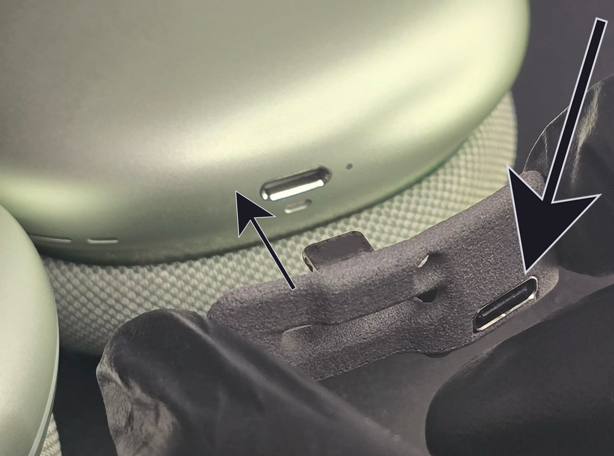
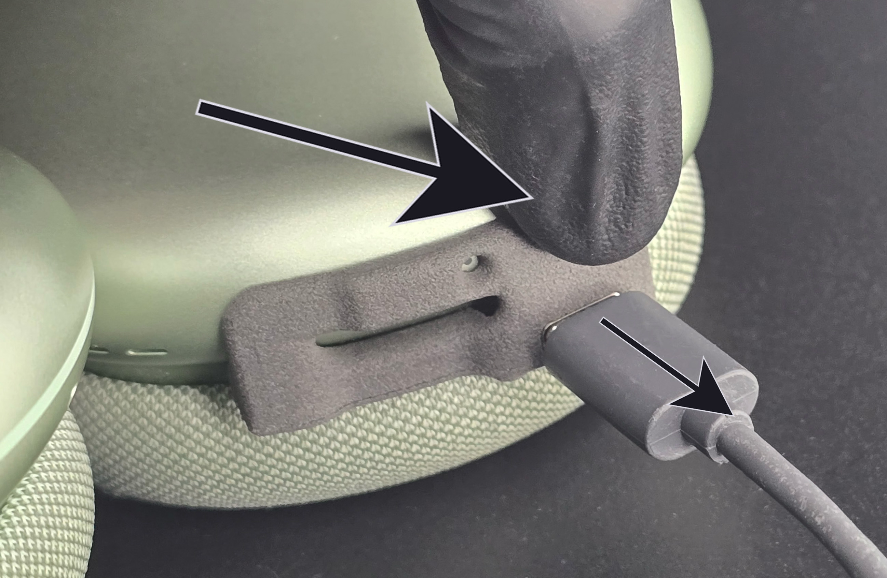
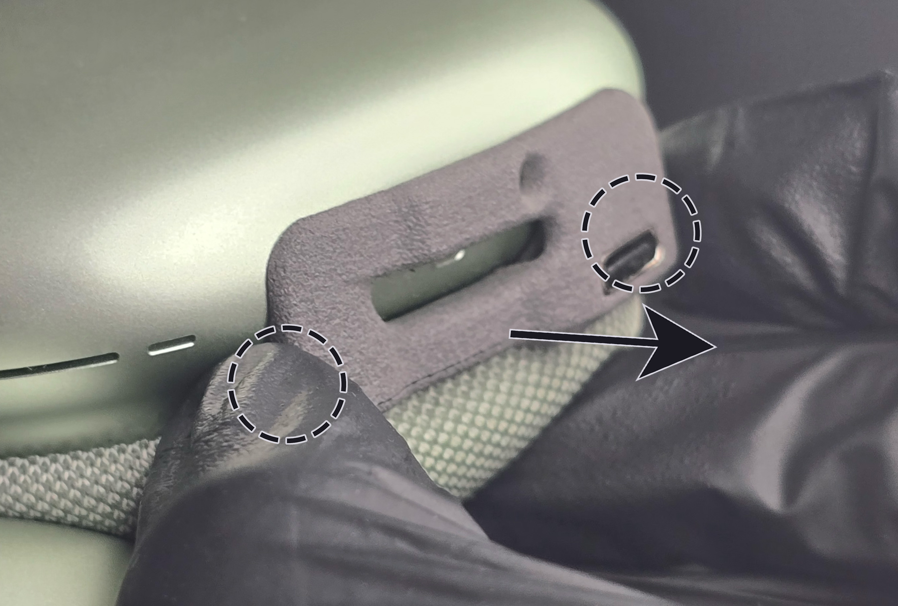

# USB-C External Adapter for AirPods Max - Installation Guide
(last updated on 29.10.24)
___

Ok, let’s get started. It's very easy. To install the adapter you just plug it in as shown with the little arrow on Figure [1](#adapter_insertion). The only thing you need to watch out for is the orientation: the USB-C port is on the right (big arrow) and at the bottom, meaning closest to the mesh ear pads.

<figure markdown id="adapter_insertion">
  
  <figcaption><b>Figure 1.</b> Adapter Insertion</figcaption>
</figure>

Now you can easily plug in a USB-C cable and start charging.

When you unplug the USB-C cable, as shown with the small arrow on Figure [2](#cable_disconnect), make sure to always hold the adapter with your finger to make sure not to damage it (big arrow on Figure [2](#cable_disconnect)).

<figure markdown id="cable_disconnect">
  
  <figcaption><b>Figure 2.</b> Cable Disconnect</figcaption>
</figure>

To remove the adapter, hold it firmly on both sides near the bottom (dashed circles on Figure [3](#adapter_disconnect)) and squeeze with those two fingers while pulling in the direction of the arrow ( = the opposite direction of when you plugged it in). This ensures a uniform unplugging movement. Do not try to remove the adapter by prying from only one side, you might break the plastic casing. 

<figure markdown id="adapter_disconnect">
  
  <figcaption><b>Figure 3.</b> Adapter Disconnect</figcaption>
</figure>

___

You did it!! Congrats :) Because you bought from my shop, you gained writing access to my Discord server with the link inside your order confirmation email. Please post a picture of your final result! You can also tweet it at me if you'd like. I would really appreciate it and will definitely congratulate you again.
