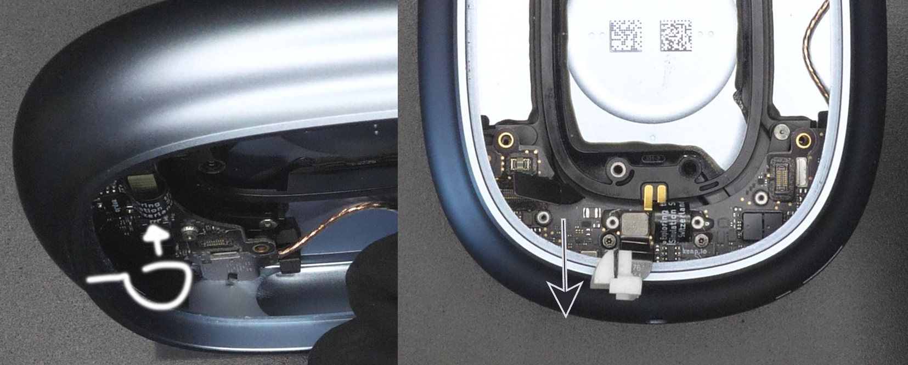

# USB-C Kit (v1.1) - Assembly Guide - AirPods Max
(last updated on 22.03.24)
___
## Intro

Before, you start:

* Check the [compability of your headphones](compatibility.md)
* Check your [kit version number](versions.md) and make sure it matches the version of this guide
* Watch the [video](video.md), but then follow this guide when you install your kit

___

## Tools

* A SIM eject tool, or a paper clip, or needle.
* iSesamo prying tool, or iFixit Jimmy.
* A Pentalobe P5 (=1.2mm) screwdriver.
* A Torx T1 screwdriver that has a total length of 7cm or below. I recommend using a T1 screwdriver tip because it is only around 3cm in total length, so it works perfectly for our application.
* A Torx T3 screwdriver. 
* A Torx T5 screwdriver. 
* A pair of fine tweezers.
* A vise, I’m using a Stanley 83-069, but you can use any vise. Ideally your vise has soft rubber jaws, mine has nice removable ones. If you don’t have soft jaws, you can use metal jaws and protect your case with masking tape.

___

## Installation

Start by removing the Right Ear Cushion. It is magnetically attached and can be removed very easily by just pulling on it.

Detach the whole Right Ear Assembly from the headband. To do so, insert the SIM eject tool (or paper clip) inside the little hole at the top (Figure [1](#remove-headband), small straight arrow) and push the headband out (Figure [1](#remove-headband), direction of big straight arrow).

Using the Pentalobe P5 screwdriver, turn each screw in the direction of the curved arrows (Figure [1](#remove-headband)). You will only be able to turn about a quarter turn. This is normal.

<figure markdown id="remove-headband">
  
  <figcaption><b>Figure 1.</b> Headband and Plastic Cover Removal</figcaption>
</figure>

With the iSesamo, work your way around the plastic cup. You should be able to insert it between the plastic cup and metal frame. Avoid the area circled on Figure [2](#plastic-cup-removal). There is a flex cable there, we don't want to damage it. Don't lift up the plastic cup fully, it is still connected with the flex cable.

<figure markdown id="plastic-cup-removal">
  
  <figcaption><b>Figure 2.</b> Plastic Cup Removal</figcaption>
</figure>

While being careful of not breaking the flex cable (Figure [3](#plastic-cup-flex), small arrow), remove the T1 screw (Figure [3](#plastic-cup-flex), big arrow).

Remove the metal bracket that was underneath the screw.

Disconnect the B2B connector that was underneath the metal bracket. You can now set aside the whole plastic cup assembly.

<figure markdown id="plastic-cup-flex">
  
  <figcaption><b>Figure 3.</b> Plastic Cup Flex Removal</figcaption>
</figure>

As with any teardown, you'll want to disconnect the battery as soon as possible. To do so, remove the T3 screw (Figure [4](#battery-connector-removal), big arrow) and the T1 screw (Figure [4](#battery-connector-removal), small arrow). 

Remove the metal bracket that was underneath the screws.

Disconnect the two B2B connectors that were underneath the metal bracket. (one connects the battery and the other is connected to a microphone)

<figure markdown id="battery-connector-removal">
  
  <figcaption><b>Figure 4.</b> Battery Connector Removal</figcaption>
</figure>

Now we want to remove the speaker. It has a fragile membrane so make sure not to touch it or puncture it with your tools. When removing the next 4 screws, make sure to hold them with some tweezers while unscrewing them. There is a magnet in the speaker, the screws can get attracted and damage the membrane. We want to avoid this. 

Remove the two T3 screws (Figure [5](#speaker-removal), two top arrows).

Remove the T3 screw (Figure [5](#speaker-removal), bottom left arrow). This screw has a thicker thread, don't mix it up with the other two T3 screws. 

Remove the special screw (Figure [5](#speaker-removal), bottom right arrow). It has a special profile, a flathead screwdriver will probably be too thick to engage it. I recommend using the right-angled part of the iSesamo. Always turn counter-clockwise to unscrew.

You can now carefully lift the speaker and set it aside.

<figure markdown id="speaker-removal">
  
  <figcaption><b>Figure 5.</b> Speaker Removal</figcaption>
</figure>

Remove the three T3 screws (Figure [6](#battery-top-screws)).

<figure markdown id="battery-top-screws">
  
  <figcaption><b>Figure 6.</b> Battery Top Screws Removal</figcaption>
</figure>

Remove the final two Torx T5 screws (Figure [7](#battery-side-screws)) holding the battery in place.

You can now carefully lift away and remove the battery. The two cells (one on each side) are connected together with a cable. If you just want to replace the battery you can stop here and follow the instructions backwards. The battery is surprisingly easy to replace... kudos to Apple for once!

<figure markdown id="battery-side-screws">
  
  <figcaption><b>Figure 7.</b> Battery Side Screws Removal</figcaption>
</figure>

Now we want to remove the old charging port. Start by removing the two T1 screws (Figure [8](#lightning-disconnect), small arrows.)

Remove the metal bracket that was underneath the screws. We will call it the smile bracket.

Disconnect and lift off the two connectors. The one on the right is the Lightning connector, the one on the left is a microphone. They are still stuck to the main chassis, so don't try to completely take them out just yet.

Remove the two T3 screws (Figure [8](#lightning-disconnect), big arrows).

<figure markdown id="lightning-disconnect">
  
  <figcaption><b>Figure 8.</b> Lightning and Mic Connector Removal</figcaption>
</figure>

Carefully slide the power board away while making sure it doesn't get stuck on the flex B2B connectors we previously disconnected (on Figure [8](#lightning-disconnect) and [4](#battery-connector-removal)). The power board will still be connected with a cable (Figure [9](#power-board-removal)), so watch out not to damage it.

<figure markdown id="power-board-removal">
  
  <figcaption><b>Figure 9.</b> Power Board Removal</figcaption>
</figure>

This step will be almost impossible if you don't have the right tools. I've tried removing the screw with the wrong screwdriver, ended up stripping it and wasted hours to get it out. Consider yourself warned. You need a T1 screwdriver that has a total length of 7cm or below. This is why I recommend using a T1 screwdriver tip (just the tip, not the whole screwdriver), because it is only around 3cm in total length, so it works perfectly for our application. The reason we need a short screwdriver is that if it doesn't fit fully inside the cup, the angle at which you will try to engage the screw will be too awkward and you won't be able to unscrew it.

Remove the two T1 screws (Figure [10](#metal-lip-screws), big arrows) with the short T1 screwdriver as previously discussed. Just rotate the tip directly with your fingers.

Remove the two T3 screws (Figure [10](#metal-lip-screws), small arrows).

You can now remove the Lightning charging port and the microphone.

<figure markdown id="metal-lip-screws">
  
  <figcaption><b>Figure 10.</b> Metal Lip Screws</figcaption>
</figure>

We now want to completely remove the metal lip that was holding the Lightning connector. It is very firmly glued to the main chassis, with the infamous "Apple Green Glue". I tried applying heat to remove it, didn't work. A bit difficult to access with chemicals, so that left me with one last option; force. 

You need to jam a screwdriver in the charging hole. The screwdriver needs to have a total diameter smaller than the chassis (on Figure [11](#metal-lip-detail) in blue) and the tip of the screwdriver needs to fit inside the metal lip (on Figure [11](#metal-lip-detail) in gray). Thankfully, most small screwdrivers will work for this.

<figure markdown id="metal-lip-detail">
  
  <figcaption><b>Figure 11.</b> Metal Lip Detail</figcaption>
</figure>

You can now secure the main chassis in a vise and carefully hammer down the metal lip (Figure [12](#metal-lip-hammer)). Watch out to not damage the power board that is still hanging (from Figure [9](#power-board-removal)). Make sure to only hit the gray part! Here we really want to avoid hitting the blue part (that will depend on the colorway of your headphones). The metal lip will just fall down.

Disassembly is over, we can now install the USB-C kit!

<figure markdown id="metal-lip-hammer">
  
  <figcaption><b>Figure 12.</b> Metal Lip Hammering</figcaption>
</figure>

Place the power board back in place while making sure the B2B connector (Figure [4](#battery-connector-removal), small arrow) goes on top of the board.

Stick the round spacer in place (Figure [13](#round-spacer), right arrow). The color of the spacer might change (here is white, but it can be orange or blue). The tape is already applied on the spacer, you just need to carefully peel off one layer on the light brown side. You need to make sure that the spacer is properly centered and that it doesn't touch any of the surrounding SMD components. If you have some black residue on your fingers, it's just some burn marks from the laser cutting process, nothing to worry about. 

<figure markdown id="round-spacer">
  
  <figcaption><b>Figure 13.</b> Round Spacer Application</figcaption>
</figure>

Stick the right-angled spacer in place as shown on the right of Figure [14](#pcb-spacer). Again here, the tape is already applied on the spacer and its color might change.

<figure markdown id="pcb-spacer">
  
  <figcaption><b>Figure 14.</b> PCB Spacer Application</figcaption>
</figure>

Take the microphone we previously removed. Where the golden rectangle is, but on the opposite side of the flex PCB, there is a very small hole. That's where sounds come in. We will call it the MEMS sound hole. Make sure to carefully peel off all the adhesive surrounding that hole.

Insert the microphone inside its custom holder that is included in the kit. With the hole facing down (Figure [15](#mic-holder), shown with the arrow), make sure the microphone PCB is inserted with the flexing part sticking out of the left side (Figure [15](#mic-holder), right image).

Check that you can clearly see the MEMS sound hole through the hole in the microphone holder (Figure [15](#mic-holder), shown with the arrow).

<figure markdown id="mic-holder">
  
  <figcaption><b>Figure 15.</b> Microphone Holder Insertion</figcaption>
</figure>

Place the USB-C PCB while making sure the mounting holes are lined up with the holes of the power board.

Insert and screw in the two T3 screws (Figure [16](#usbc-screws), shown with the arrows). Do not screw them all the way just yet.

<figure markdown id="usbc-screws">
  
  <figcaption><b>Figure 16.</b> Securing the USB-C PCB</figcaption>
</figure>

We want to connect the flex PCB we just secured in place to the mainboard. To do so, bend the flexible part so that it rotates 180 degrees and connect it to the mainboard by pressing it down with some tweezers (Figure [17](#usbc-screws), left image).

Connect the microphone back to the mainboard while making sure the flex part is pointing in the direction of the charging hole (Figure [17](#usbc-mic-connectors), right image).

<figure markdown id="usbc-mic-connectors">
  
  <figcaption><b>Figure 17.</b> Plugging in the UBS-C and microphone flexes</figcaption>
</figure>

Now we secure the two B2B connectors we just connected. To do so, we take the smile bracket, make sure the black tape on it is facing up (and the padding is facing down) and place it through the 180 degrees loop of the USB-C flex we just created. It's called the smile bracket because it has a slight curve (Figure [18](#smile-bracket), left image) and it's important to place it so that the curve matches the curve of the power board.

Insert and screw in the two T1 screws (Figure [18](#smile-bracket), arrows on right image).

Slightly unscrew the screws from Figure [16](#usbc-screws), plug in a USB-C cable to make sure everything is lined up, and then tighten the screws fully (not like crazy though). This will make sure the USB-C connector lines up correctly with the hole in the main chassis. 

<figure markdown id="smile-bracket">
  
  <figcaption><b>Figure 18.</b> Smile Bracket Placement</figcaption>
</figure>

Take the small piece of tape included in the kit (it's rectangular), peel off one protective layer, and apply it on the bottom of the microphone holder (Figure [19](#mic-placement), left image). Remove the second brown protective layer to exposive the sticky side.

Then insert the microphone holder in between the USB-C connector and the main chassis. Make sure the gold connector is facing up (Figure [19](#mic-placement), middle image). Push it as much as you can towards the charging hole. Also apply some downwards pressure to make sure the tape sticks to the USB-C connector. End result should look like the right image on Figure [19](#mic-placement).

<figure markdown id="mic-placement">
  
  <figcaption><b>Figure 19.</b> Microphone Placement</figcaption>
</figure>

You're almost there! We just want to reassemble the last few pieces, should be very very easy.

Place the battery back in place. Screw in the two Torx T5 screws from Figure [7](#battery-side-screws).

Screw back in the three T3 screws from Figure [6](#battery-top-screws).

Place the speaker back in place. Make sure that golden pins underneath are on the same side where the pins of the power board are. 

Here is a tip if you made some creases on your membrane. Take some tape and very gently pull the creases out (Figure [20](#crease-removal)). Works like magic! I even had some creases on my membrane even though it was untouched from the factory.

<figure markdown id="crease-removal">
  
  <figcaption><b>Figure 20.</b> Speaker Crease Removal</figcaption>
</figure>

Screw back in the three T3 screws and the special screw from Figure [5](#speaker-removal).

Connect the two B2B connectors from Figure [4](#battery-connector-removal). Place the metal bracket back on top and screw back in the T3 and T1 screw (from the same Figure).

Connect the B2B connector from the plastic cup. Make sure the orientation matches Figure [3](#plastic-cup-flex). Place back on top the metal bracket and screw back in the T1 screw. 

Insert the plastic cup back inside the main chassis. Turn the four Pentalobe P5 screws in the opposite direction as the ones shown on Figure [1](#remove-headband). They will only rotate about a quarter of turn or so.

Insert the headband back in.

___

You did it!! Congrats :) Because you bought from my shop, you gained writing access to my Discord server with the link inside your order confirmation email. Please post a picture of your final result! You can also tweet it at me if you'd like. I would really appreciate it and will definitely congratulate you again.
