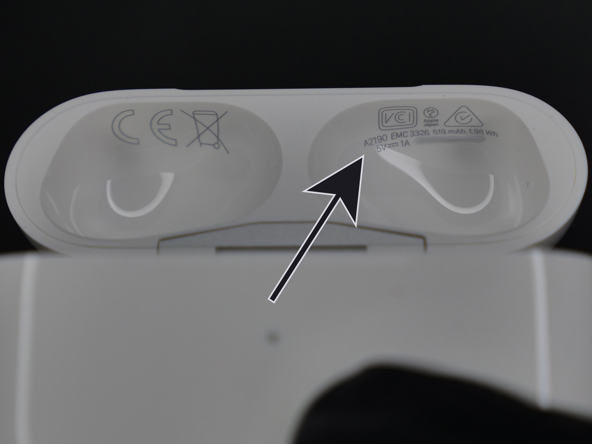

# USB-C Kit - Compatibility
(last updated on 11.03.24)
___
## Model Number

The kit is compatible with case model number A2190. You can find it on the underside of the lid.

If your case says "Assembled in Vietnam" on the back, right above the pairing button, DO NOT PROCEED. Continue reading.

<figure markdown>
  
  <figcaption><b>Figure 1.</b> Model Number Location</figcaption>
</figure>
___

## What's the problem?

The kit is compatible with all A2190 cases, but some of them will be very difficult to open. The reason is that some versions of the case have glue that is applied in a very awkward spot, making it very likely you will destroy the wireless charger while disassembling it. Continue reading to see if your case is affected. 
___

## Assembled in Vietnam?

Behind the case, right above the pairing button, there is some text saying "Assembled in ...":

- "Assembled in China": Your case should be openable/repairable without too much risk, you can stop reading this page and go back to the instructions.  
- "Assembled in Vietnam": Continue reading to see if you're affected.
___
## Magsafe?

Under the lid, you will find your model number. It should be A2190. Next to that, there should also be a string of 12 characters. This is your serial number. Look for the 4 last characters and compare them with this list:

* Last 4 characters are "0C6L" or "LKKT". Your case is only Wireless, not Magsafe. It should be openable/repairable without too much risk, you can stop reading this page and go back to the instructions.  
* Last 4 characters are "1NRC". Your case is Magsafe. I have not encoutered Vietnamese cases with this serial ending. There is a chance that it has the same problem. Read the [Solution Paragraph](#solution) just in case.
* Last 4 characters are "1059". Your case is Magsafe. Continue reading to see if you're affected.
___

## Serial ...1059?

As far as I'm aware, there are four versions. If you have something else, please contact me. You need to look at the first two characters of your serial number:

* First 2 characters are "H1". Your case should be openable/repairable without too much risk, you can stop reading this page and go back to the instructions.  
* First 2 characters are "H2" or "H3". Unsure if this version is problematic, read the [Solution Paragraph](#solution) just in case.
* First 2 characters are "H6". This version is definitely problematic. Read the [Solution Paragraph](#solution).

___

## Solution 

 If you made it this far, it means you have a version that is probably problematic. Luckily for you, there is now a solution that guarantees you can still install the mod. Indeed, the wireless charger replacement part has been made available from China recently. And it just costs \$2-$3! So that means you can try to open the case and if you end up breaking the wireless charger, you can replace it very easily.

You can find this part on my shop ([here](https://shop.kenp.io/products/airpods-pro-wireless-charging-flex)) for your convenience or you might be able to find it slightly cheaper on AliExpress.