# USB-C Kit (v3) - Assembly Guide
(last updated on 22.10.23)
___
## Intro

Before, you start:

* Check the [compability of your case](compatibility.md)
* Check your [kit version number](versions.md) and make sure it matches the version of this guide
* Watch the [video](video.md), but then follow this guide when you install your kit

___

## Tools
* A vise, I’m using a Stanley 83-069, but you can use any vise. Just make sure you can open the jaws wide enough to fit the 61mm length of the case. Ideally your vise has soft rubber jaws, mine has nice removable ones. If you don’t have soft jaws, you can use metal jaws and protect your case with masking tape.
* A Torx T4 screwdriver, T5 also works. 
* A pair of fine tweezers.
* A small quantity of Isopropyl Alcohol (otherwise known as IPA, 2-propanol or Isopropanol). Make sure you get 99 percent purity or above. Sometimes if you get it from a pharmacy or drug store they can sell you 60 percent purity and it’s really not great for electronics. It's important to note that rubbing alcohol may sometimes contain other additives, so it might not be 100% isopropyl alcohol. Pure Acetone could also potentially help if you only have this. Do not use WD-40.
* A guitar pick. I found that the Ernie Ball Everlast 0.73mm works great. If you placed an order before 25.04.23 you will get a guitar pick with your PCB, otherwise you can order one from my shop. They usually come in packs of 12 if you buy them yourself.

* (Optional) A hot air gun, heat gun, or hair dryer.

___

## Installation

Ok, let’s get started. Let me show you what we are trying to achieve. We want to break the glue bonds, especially around the plastic teeth.  

<figure markdown id="front_teeth_location">
  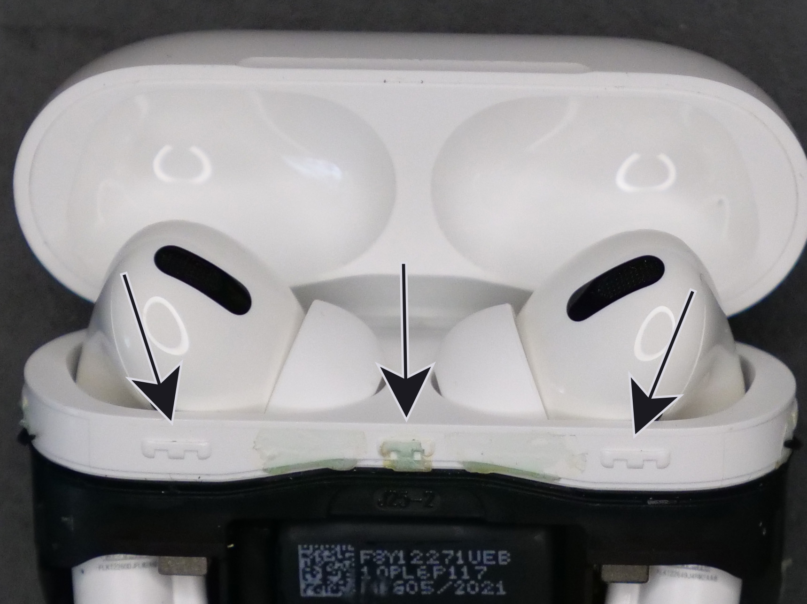
  <figcaption><b>Figure 1.</b> Front Teeth Location</figcaption>
</figure>

<figure markdown id="side_and_back_teeth_location">
  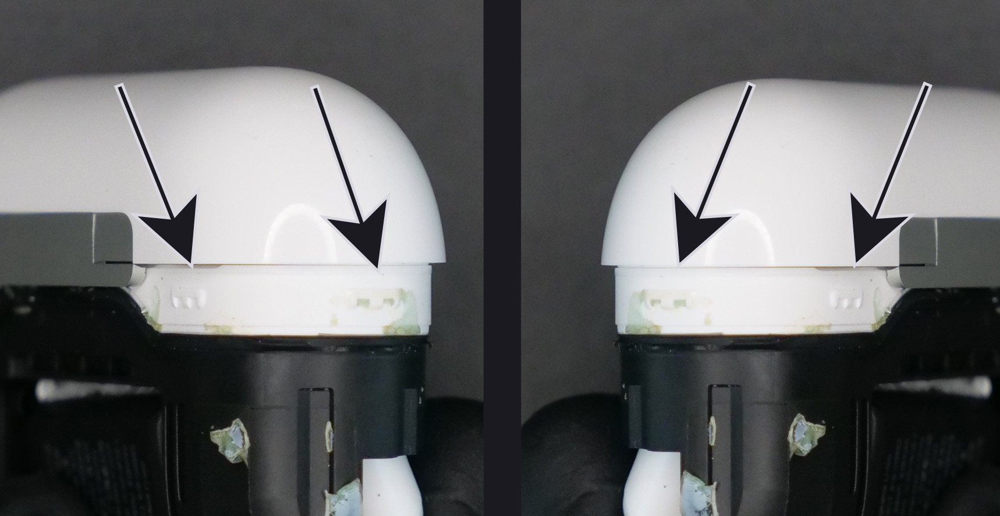
  <figcaption><b>Figure 2.</b> Side and Back Teeth Location</figcaption>
</figure>

Clamp your case sideways, make sure you removed the AirPods buds and that the lid is open. We want to start closing the jaws to apply pressure on the case. 

<figure markdown id="side_pressure">
  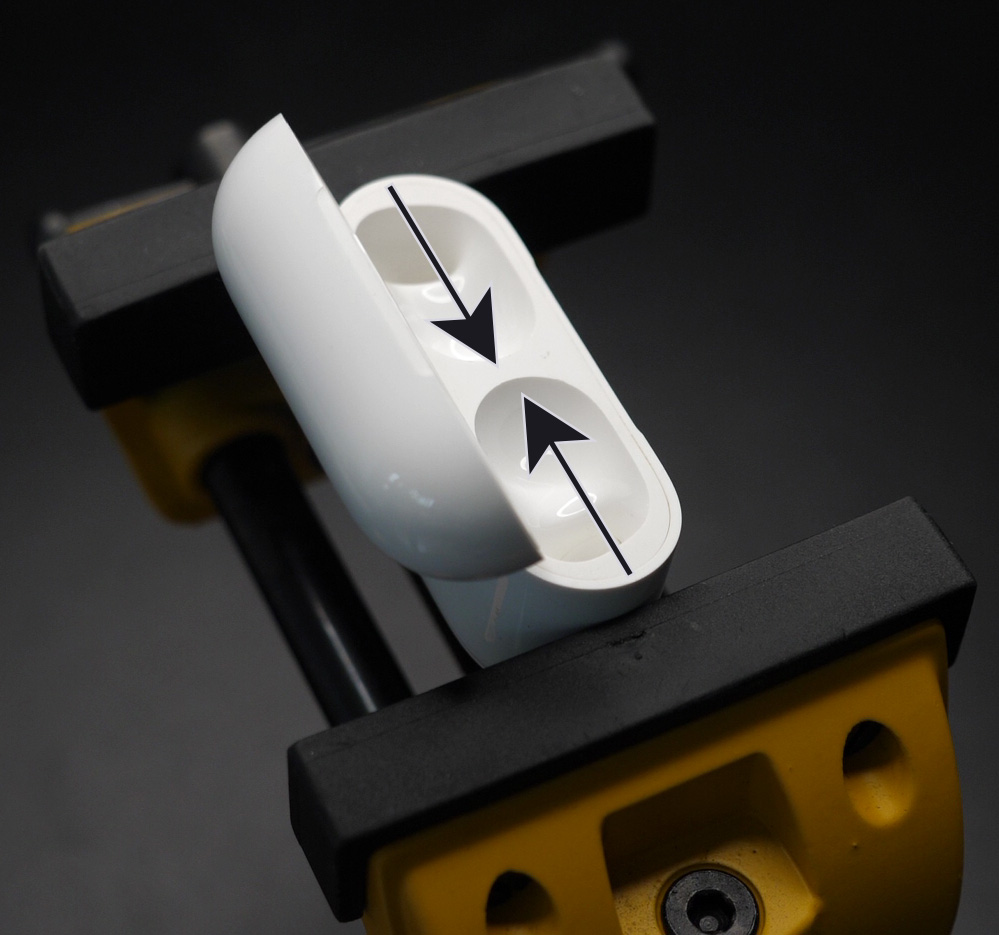
  <figcaption><b>Figure 3.</b> Side Pressure</figcaption>
</figure>

That pressure will create two small gaps between the middle frame and the outer shell. Once you have a gap big enough to fit the guitar pick, you can insert it (Figure [4](#first_guitar_pick_insertion), small arrow) and slide the guitar pick on the side as shown (Figure [4](#first_guitar_pick_insertion), direction of the big arrow). This will break the glue bond.

<figure markdown id="first_guitar_pick_insertion">
  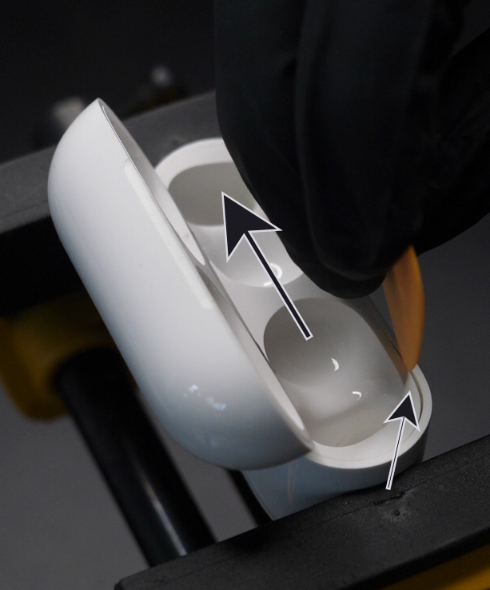
  <figcaption><b>Figure 4.</b> First Guitar Pick Insertion</figcaption>
</figure>

Now we rotate the case 90 degrees and clamp it in the vise. Make sure you leave at least a 10mm gap on top of the jaws (Figure [5](#clamping_gap), double arrow). Insert your guitar pick in the front of the device and slide it on one side as far as it will go (Figure [6](#corner_stop_and_ipa_application) shows where you can stop). While sliding the guitar pick, I found that making a "wave" motion helped, I show this in the video at the top of the page.   

<figure markdown id="clamping_gap">
  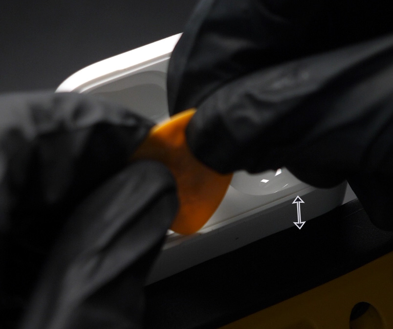
  <figcaption><b>Figure 5.</b> Clamping Gap</figcaption>
</figure>

Leave the Guitar Pick inserted and squeeze a few drops of IPA so that it flows through the gaps you just created and let it sit for 30 seconds. After the 30 seconds, remove the Guitar Pick.

<figure markdown id="corner_stop_and_ipa_application">
  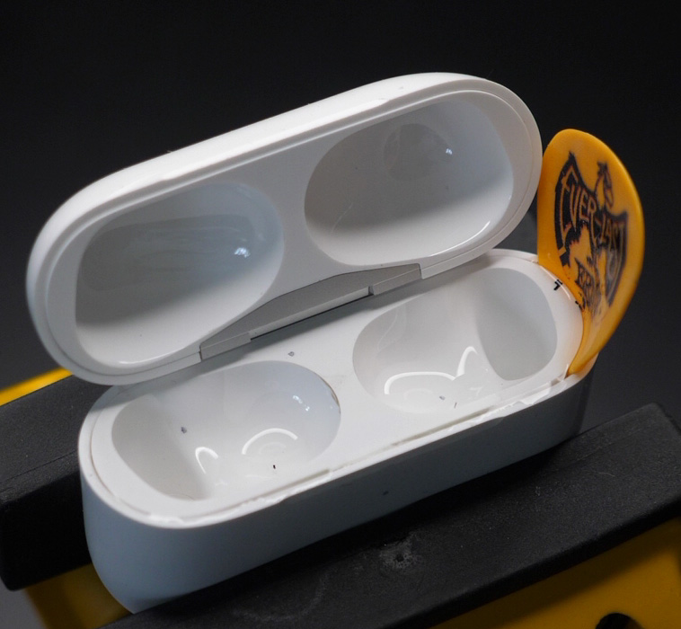
  <figcaption><b>Figure 6.</b> Corner Stop and IPA application</figcaption>
</figure>

Insert the Guitar Pick near the LED and repeat the same sliding operation for the other corner. Squeeze a few drops of IPA so that it flows through the gaps you just created and let it sit for 30 seconds. After the 30 seconds, leave the Guitar Pick inserted.

Rotate the case 180 degrees and clamp it in the vise.

What we want to do is to keep the Guitar Pick in that gap and continue working our way to the back of the case. As soon as you can, you will want to partially close the lid and push the Guitar Pick behind the lid (shown on Figure [7](#first_back_corner_and_ipa_application)). Go as far back as you can, then drop some IPA and wait 30 seconds. 

<figure markdown id="first_back_corner_and_ipa_application">
  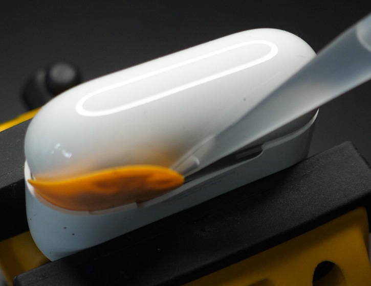
  <figcaption><b>Figure 7.</b> First Back Corner and IPA application</figcaption>
</figure>

Remove the Guitar Pick and insert it in the other corner. Repeat the same procedure to make your way to the back of the case (shown on Figure [8](#second_back_corner_and_ipa_application)). Drop some IPA and wait 30 seconds. Keep the Guitar Pick inserted.

<figure markdown id="second_back_corner_and_ipa_application">
  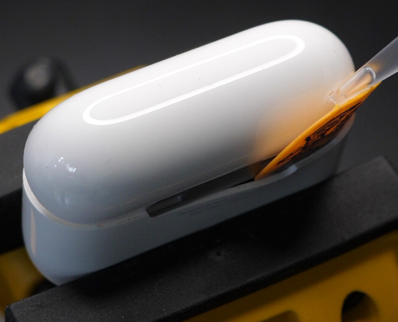
  <figcaption><b>Figure 8.</b> Second Back Corner and IPA application</figcaption>
</figure>

Slide the Guitar Pick through the back of the case in order to join the other corner (Figure [9](#back_side_sliding), direction of the arrow). Do not insert the Guitar Pick too deep in the case for this, as the Wireless Charging Coil is located right underneath the hinge. About 2mm deep is good. I found that rotating the Guitar Pick along its center of mass while having a forward movement helped to slide it through the back without going too deep. 

Remove the Guitar Pick. 

<figure markdown id="back_side_sliding">
  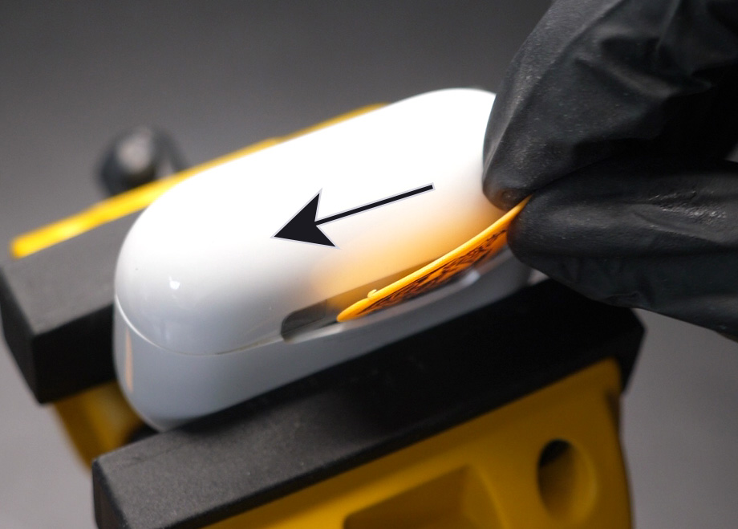
  <figcaption><b>Figure 9.</b> Back Side Sliding</figcaption>
</figure>

Rotate the case 180 degrees and clamp it in the vise.

We will now lift the top assembly out, meaning that most of the glue bonds should be broken by now. If you see that a side is already lifting up, that's a very good sign. If not, it's ok, but the next step needs to be done with gentle force and control over your arm movement. If you try too hard to lift the assembly, it might suddenly lift quickly and you will rip and break the flex connectors. 

<figure markdown id="wrist_twisting_movement">
  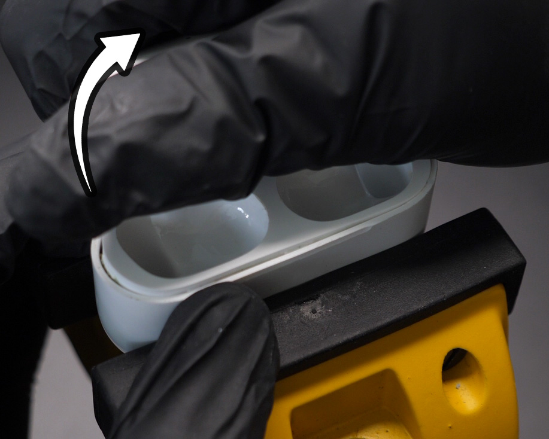
  <figcaption><b>Figure 10.</b> Wrist Twisting Movement - Left Corner</figcaption>
</figure>

Open the lid, grab it with your hand, lift it upward while twisting your wrist left and right. We are trying to slowly lift the left corner for about 1mm (Figure [10](#wrist_twisting_movement)), then the right corner for about 1mm, then the left corner again for 1mm, etc. Go slowly and there really shouldn't be any problem. 

If you feel like you are applying too much force, start the tutorial over and this time you can go a little deeper with the Guitar Pick in order to further break down the glue bonds. 

Slowly lift the top assembly out, revealing the two B2B (board-to-board) connectors and flex cables (Figure [11](#lightning_and_wireless_charging_flex_cables)).

<figure markdown id="lightning_and_wireless_charging_flex_cables">
  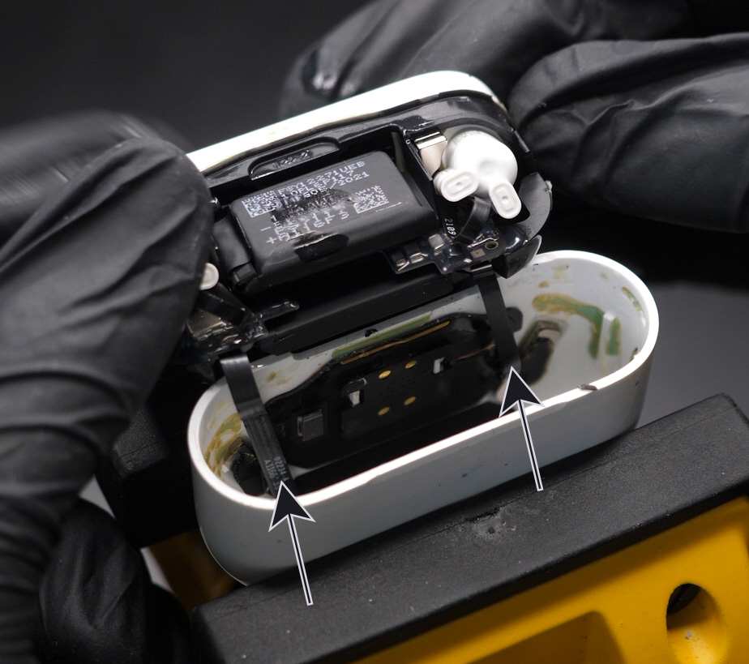
  <figcaption><b>Figure 11.</b> Lightning and Wireless Charging flex cables</figcaption>
</figure>

(Optional, but strongly recommended) Heat up the glue around the two B2B connectors. If you can control the temperature, do not go above 120 degrees Celsius for about 45 seconds. This will help for the next step.

Use tweezers or any other prying tool to disconnect the two B2B connectors (Figure [12](#lightning_and_wireless_charging_connectors)). Watch out for the small SMD components soldered on the mainboard next to those connectors, you do not want to rip them off.

<figure markdown id="lightning_and_wireless_charging_connectors">
  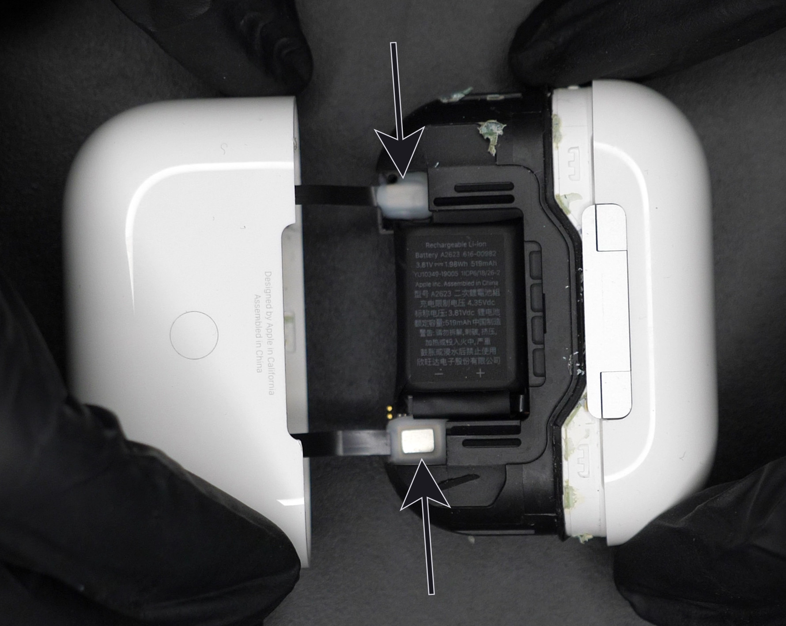
  <figcaption><b>Figure 12.</b> Lightning (bottom) and Wireless Charging (top) B2B connectors</figcaption>
</figure>

We now have the bottom shell separated. 

We can remove the two Torx T4 screws holding the Lightning connector (Figure [13](#torx_screws_and_wiggle_motion), single arrows). The connector is weakly held by glue and you can just push it back and forth (Figure [13](#torx_screws_and_wiggle_motion), motion shown by double arrow) to remove it. 

<figure markdown id="torx_screws_and_wiggle_motion">
  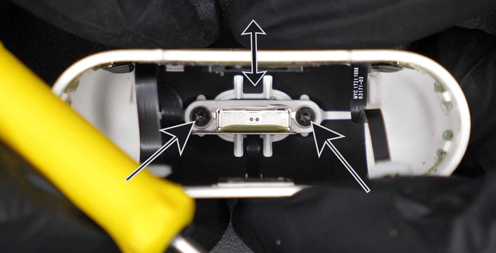
  <figcaption><b>Figure 13.</b> Torx Screws and Wiggle Motion</figcaption>
</figure>

Unglue the LED from the Outer Shell (Figure [14](#led_removal))

<figure markdown id="led_removal">
  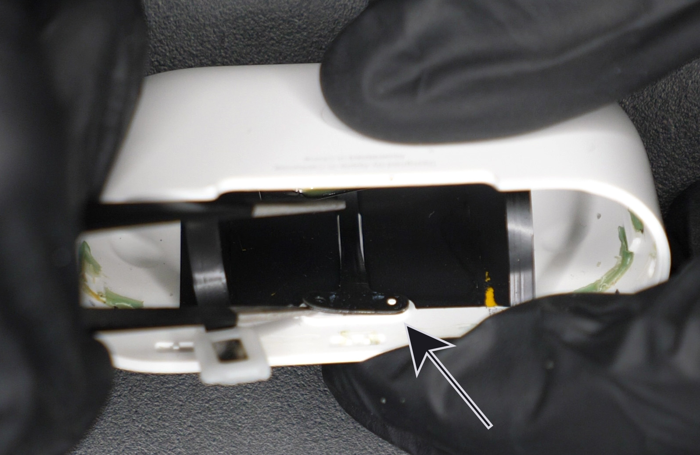
  <figcaption><b>Figure 14.</b> LED Removal</figcaption>
</figure>

You can now completely remove the Lightning connector from the Outer Shell.

Push the bottom metal slot out with your screwdriver (motion shown on Figure [15](#metal_slot_removal)). 

<figure markdown id="metal_slot_removal">
  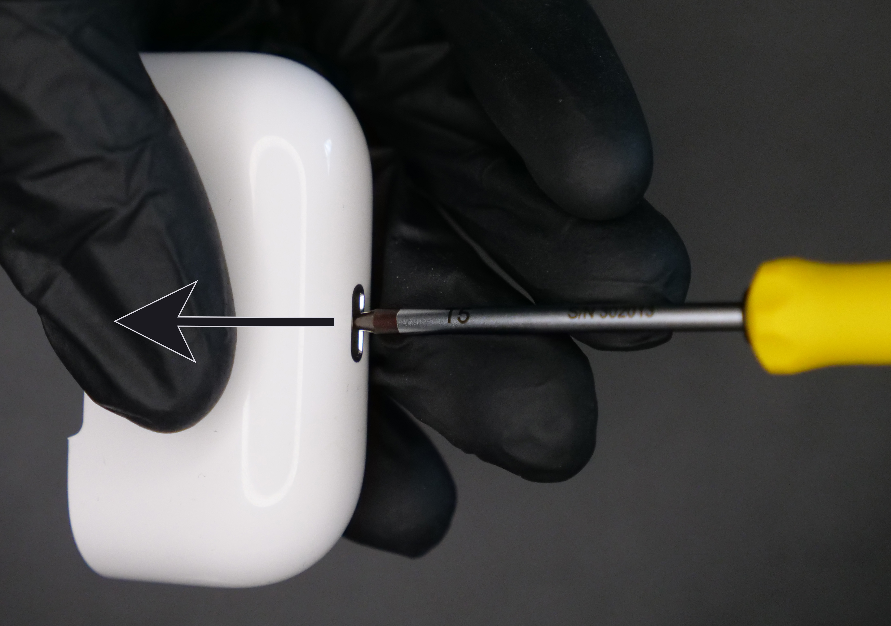
  <figcaption><b>Figure 15.</b> Metal Slot Removal</figcaption>
</figure>

Now we install the new USB-C connector. 

We start by bending it correctly so that we don’t have issues later. The LED should bend down (Figure [16](#global_bending), small arrow) and the B2B connector bend up (Figure [16](#global_bending), big arrow).

<figure markdown id="global_bending">
  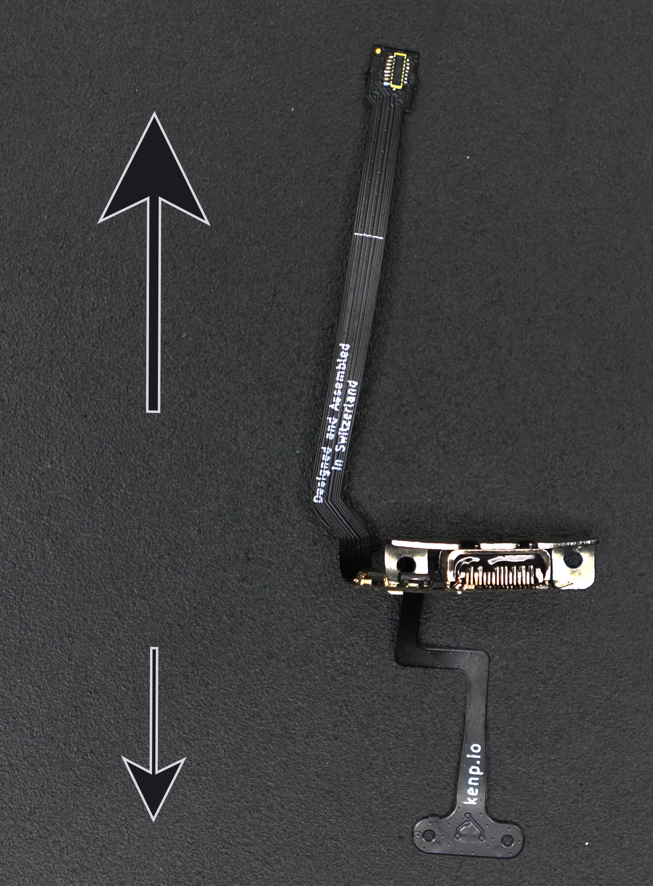
  <figcaption><b>Figure 16.</b> Global Bending</figcaption>
</figure>

We also need to bend the flex cable near the B2B connector. There are two white lines on the PCB acting as guides (an example is shown on Figure [17](#b2b_bending), big arrow). You need to bend the flex PCB where those white lines are. The white line is always "inside" the bend. Do not bend the PCB completely flat, add a small radius to your bend. It might tear if you don't add a small radius to your bend. The final bend should look like an "S", and the connector should be facing out (Figure [17](#b2b_bending), small arrow). 

<figure markdown id="b2b_bending">
  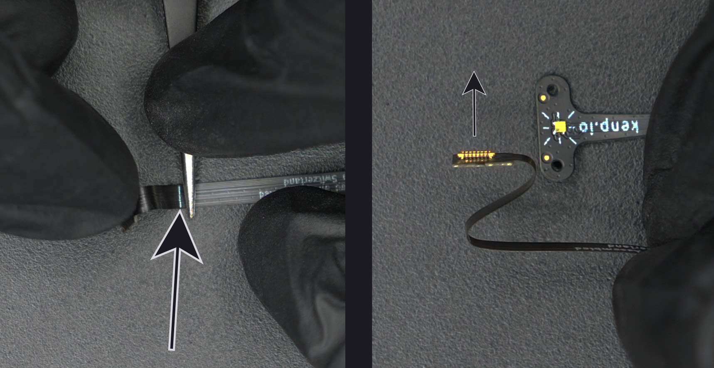
  <figcaption><b>Figure 17.</b> B2B Bending</figcaption>
</figure>

Using super knips (or something like a small pair of scissors), cut the PCB and its stiffener along the 4 red lines (Figure [A1](#v3_stiffener_fix), left). Just make sure to not damage the flex part leading to the LED (Figure [A1](#v3_stiffener_fix), arrow). We basically want to remove the parts of the PCB that are highlighted with the 2 red squares. The result is shown on the right of Figure [A1](#v3_stiffener_fix).

You don't really risk breaking something with this step because you are only cutting ground planes, it doesn't matter if they shortcircuit each other. This step is a fix to improve the connector alignment with the case. It is already done for you if you have v3.1.

<figure markdown id="v3_stiffener_fix">
  
  <figcaption><b>Figure A1.</b> v3 Stiffener Fix</figcaption>
</figure>

Take one Torx T4 screw and insert it in the hole on the side where most components are soldered. The trick is is to insert it from the side and rotate it in place, shown on Figure [18](#screw_rotation). The PCB might bend very slightly so that you can insert it, but that's ok. This "pre-insertion" is necessary because we now have a stiffener and it will be too difficult to install this screw once it's placed inside the case.

<figure markdown id="screw_rotation">
  
  <figcaption><b>Figure 18.</b> Screw Insertion</figcaption>
</figure>

Place the USB-C connector inside the Outer Shell while making sure the B2B connector is facing where the hinge slot is located and the LED is facing the other side (where the LED hole is). This is why we bent the connector on Figure [16](#global_bending).

Add the other Torx T4 screw in its hole. Screw in the two Torx T4 screws about halfway.

(Important) Now, connect a USB-C cable at the bottom of the shell and then tighten the screws all the way. This is to make sure that everything is lined up properly. Disconnect the USB-C cable.

Place the LED inside its slot on the inside of the Outer Shell. You basically need to do the opposite of what Figure [14](#led_removal) showed you. You can use the rest of the red double-sided tape to secure it in place.

Partially slide back in the top assembly and connect the two B2B connectors. Plug in a USB-C cable and make sure it is charging and everything works well. Do not go further if you don't see your AirPods charging at this point. If it doesn't charge, you most likely didn't plug in the B2B connector to the mainboard properly.

If everything works well, you can optionally add some hot glue to the two B2B connectors (shown on Figure [12](#lightning_and_wireless_charging_connectors)) to make sure they don't get disconnected in the future. 

Make sure the USB-C B2B connector bends properly (the "S" shape shown on Figure [17](#b2b_bending)) and close the whole thing. The Wireless Charging B2B connector should bend similarly. If you can't close it all the way down, it's because the connector is not bending like the "S" shape.
___

You did it!! Congrats :) Because you bought from my shop, you gained writing access to my Discord server with the QR code on the paper inside your order. Please post a picture of your final result! You can also tweet it at me if you'd like. I would really appreciate it and will definitely congratulate you again.
