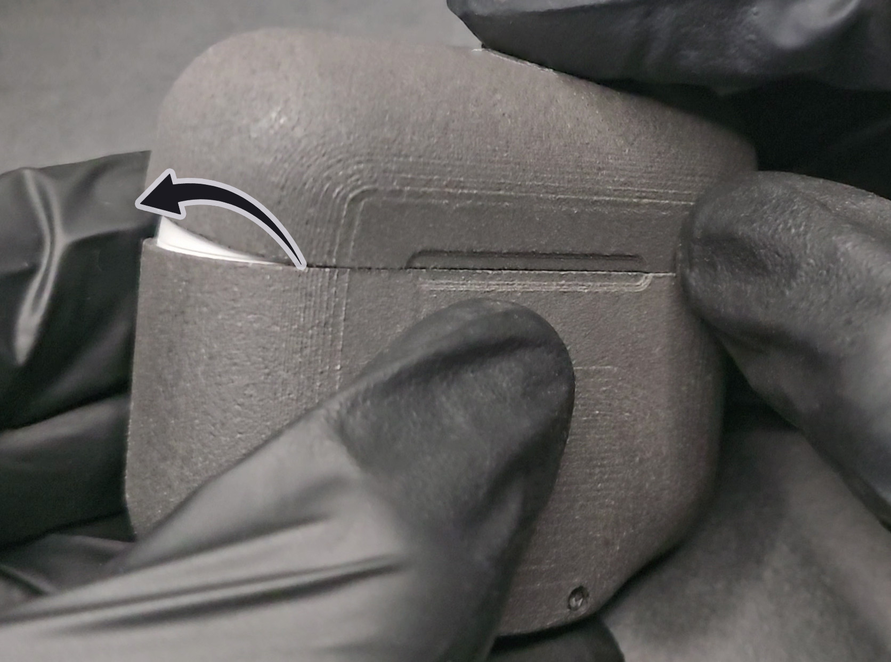
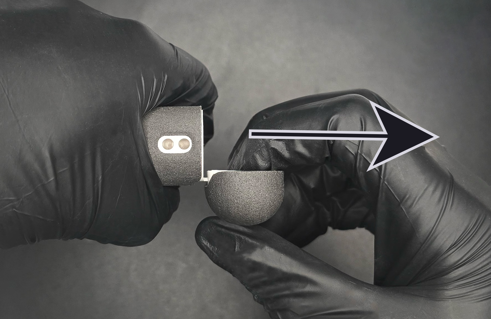

# USB-C Protection Cases for AirPods - Installation Guide
(last updated on 12.05.25)
___

This guide works for any generation of AirPods.
___

## Installation

Ok, let’s get started. It's very easy. You first start by inserting the bottom part while making sure the buttons are on the same side. It should slide in easily and click in the place near the end of the insertion. If you feel some resistance near the end of the insertion, slide the AirPods case out and check that the Lightning port is straight at the bottom of the protection case.

<figure markdown id="front_teeth_location">
  
  <figcaption><b>Figure 1.</b> Bottom Part Insertion</figcaption>
</figure>

Now use the provided alcohol pad to clean the outside of the top lid of your AirPods.

<figure markdown id="front_teeth_location">
  
  <figcaption><b>Figure 2.</b> Alcohol Pad Cleaning</figcaption>
</figure>

Remove the longer brown paper on the provided sticker and apply the sticker in the middle of the top lid of your AirPods.

<figure markdown id="front_teeth_location">
  
  <figcaption><b>Figure 3.</b> Placing the sticker</figcaption>
</figure>

Remove the dark yellow paper on the sticker to expose the sticky side. 

<figure markdown id="front_teeth_location">
  
  <figcaption><b>Figure 4.</b> Exposing the second sticker side</figcaption>
</figure>

Align the front of top part of the protection case with the front of the bottom part and rotate the part in place while holding the front together. 

<figure markdown id="front_teeth_location">
  
  <figcaption><b>Figure 5.</b> Top Part Alignment</figcaption>
</figure>

Press down on the top of the top protection case to make sure the sticker bonds correctly. **Hold while pressing for 30 seconds, this is important.**

___

Got any issue? Please read the [Troubleshooting page](troubleshooting.md).
___

## Removal

Remove the two AirPods buds from their case. Hold the protection case tightly with your left hand. With your right hand, open the lid 90 degrees and pull on it straight in the direction of the arrow as shown on Figure [6](#case_removal).

<figure markdown id="case_removal">
  
  <figcaption><b>Figure 6.</b> Case Removal</figcaption>
</figure>

___

You did it!! Congrats :) Because you bought from my shop, you gained writing access to my Discord server with the link inside your order confirmation email. Please post a picture of your final result! You can also tweet it at me if you'd like. I would really appreciate it and will definitely congratulate you again.

