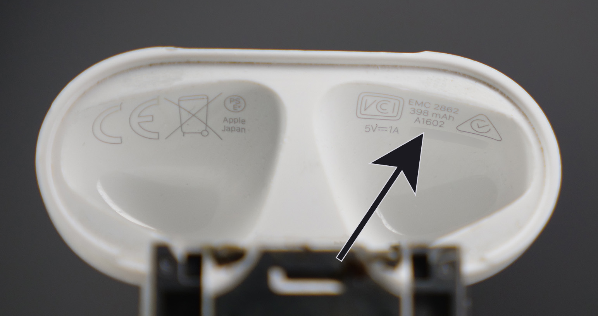

# Compatibility
(last updated on 22.10.23)
___
The USB-C kit and custom shells are compatible with case model number A1602 and A1938. You can find your model number on the underside of the lid.

<figure markdown>
  
  <figcaption><b>Figure 1.</b> Model Number Location</figcaption>
</figure>
