# AirPods Repair and Upgrade Guide
(last updated on 01.04.24)
___
## Intro

Before, you start:

* Check the [compatibility of your case](compatibility.md)

___

## Tools
* A vise, or something to hold firmly your AirPods case while leaving your hands free.
* A dremel, or anything that can cut plastic while having a little bit of control over the cutting depth. Doesn't need to be fancy. That could be something like a metal or wood saw, a metal sanding stick, a hot (or ultrasonic) knife, a soldering iron with a flat tip, or even something like super knips. 
* A metal spudger.
* A Phillips PH00 (or PH000) screwdriver. It's the most common screwdriver out there for small screws, it has the "+" shape.
* A Phillips PH0 screwdriver. Very common, it also has the "+" shape, just slightly bigger.
* A pair of fine tweezers.
* A drill with a 3mm drill bit.
* (For battery replacement only, and even then it's optional) A small quantity of Isopropyl Alcohol (otherwise known as IPA, 2-propanol or Isopropanol). Make sure you get 99 percent purity or above. Sometimes if you get it from a pharmacy or drug store they can sell you 60 percent purity and it’s really not great for electronics. It's important to note that rubbing alcohol may sometimes contain other additives, so it might not be 100% isopropyl alcohol. Pure Acetone could also potentially help if you only have this. Do not use WD-40.
___

## 1. Disassembly

Ok, let’s get started. Let me show you what we are trying to achieve. We want to break open the white shell, kind of like a Kinder Surprise. You can use any cutting tool I mentionned above, it really doesn't matter. Don't be scared, you can't really mess this part up. Just watch out for your fingers. The only thing you need to watch out is that you need to cut along the middle of the shell, demonstrated by the red line on Figure [1](#cutting_line). Don't go more than 1.2mm deep. It's better to not go too deep and than go over the line again if you feel like you haven't pierced the shell.

<figure markdown id="cutting_line">
  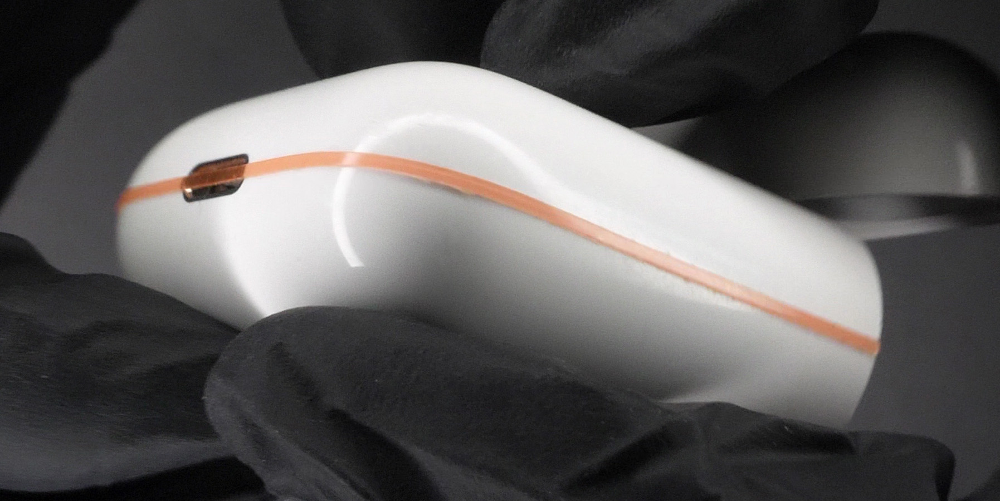
<figcaption><b>Figure 1.</b> Cutting Line</figcaption>
</figure>

Use the metal spudger to help you breaking the outer white shell free. Once you're done, you're left with the outer white shell (Figure [2](#successfull_cutting_operation), left) and the rest of the AirPods case (Figure [2](#successfull_cutting_operation), right).

<figure markdown id="successfull_cutting_operation">
  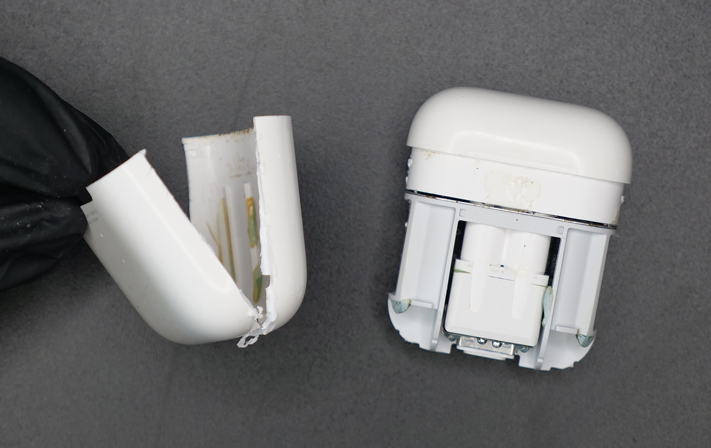
<figcaption><b>Figure 2.</b> Successfull cutting operation</figcaption>
</figure>

On the back of the AirPods case, remove the two Phillips screws (Figure [3](#buds_charging_flex_unplugging)). Then, with your tweezers, remove the protective metal bracket under those screws (let's call it MB01). Once this is done, carefully unplug the flex B2B connector with some tweezers.

<figure markdown id="buds_charging_flex_unplugging">
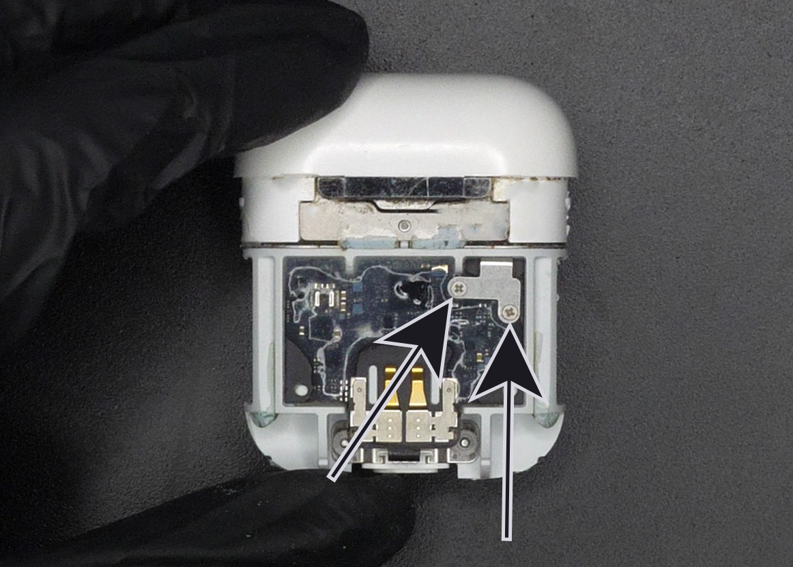
<figcaption><b>Figure 3.</b> Buds charging flex unplugging</figcaption>
</figure>

Once the flex is unplugged, try to push it back in the little hole where it's coming out of (Figure [4](#pushing_the_flex), push in the direction of the arrow). Basically we're trying to avoid ripping this flex cable off accidentaly in the next step.

<figure markdown id="pushing_the_flex">
  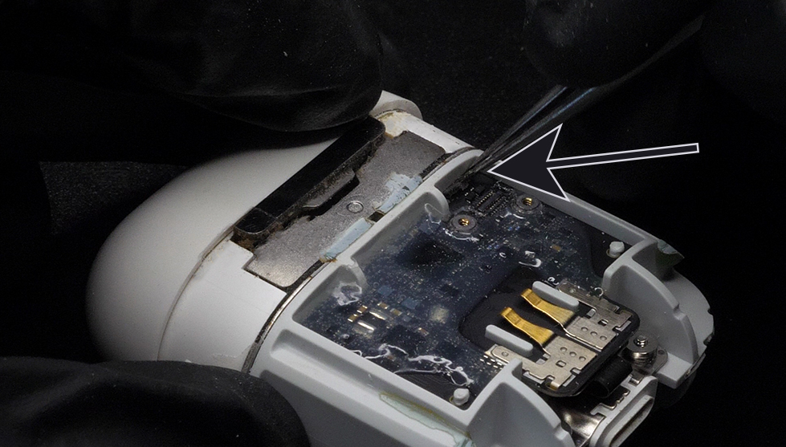
<figcaption><b>Figure 4.</b> Pushing the flex</figcaption>
</figure>

Now insert the metal spudger in the black area (Figure [5](#clamping_gap), top arrow) between the two plastic parts of the case. Make sure to be above the metal spacer (Figure [5](#clamping_gap), bottom arrow). Work your way around the case while not going deeper than a few millimeters. On the back, you can stop when you hit the metal hinge. We just want to remove the adhesive from that black foam above the metal spacer.

<figure markdown id="clamping_gap">
  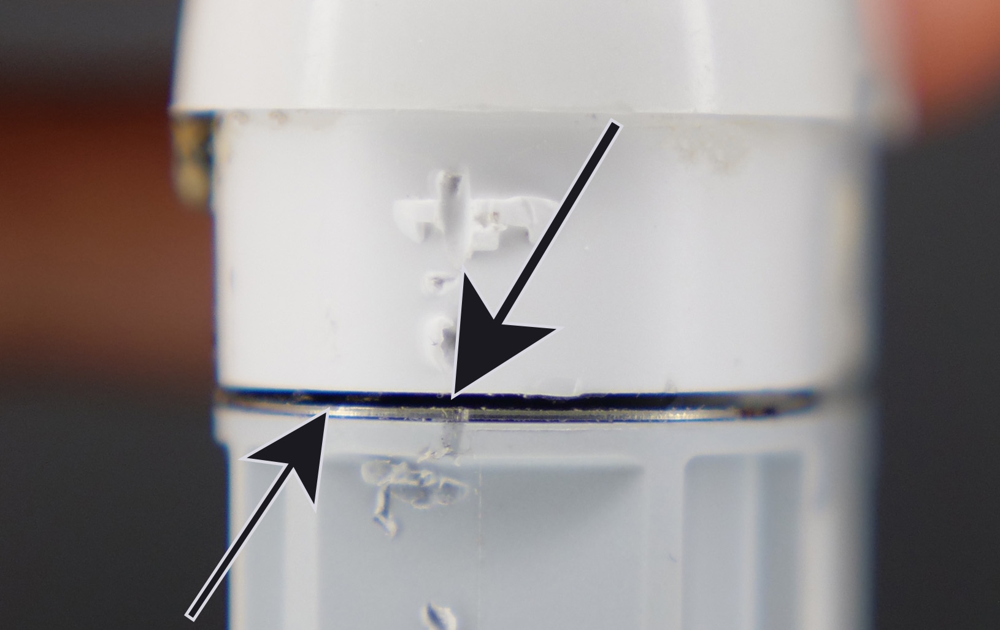
<figcaption><b>Figure 5.</b> Clamping Gap</figcaption>
</figure>

Insert the metal spudger on the side of the case. We are trying to separate and lift the upper plastic part from the hinge. You need to try to rotate the spudger as shown on Figure [6](#twisting_motion). Always rotate so that the backside (where the hinge is) lifts first.

<figure markdown id="twisting_motion">
  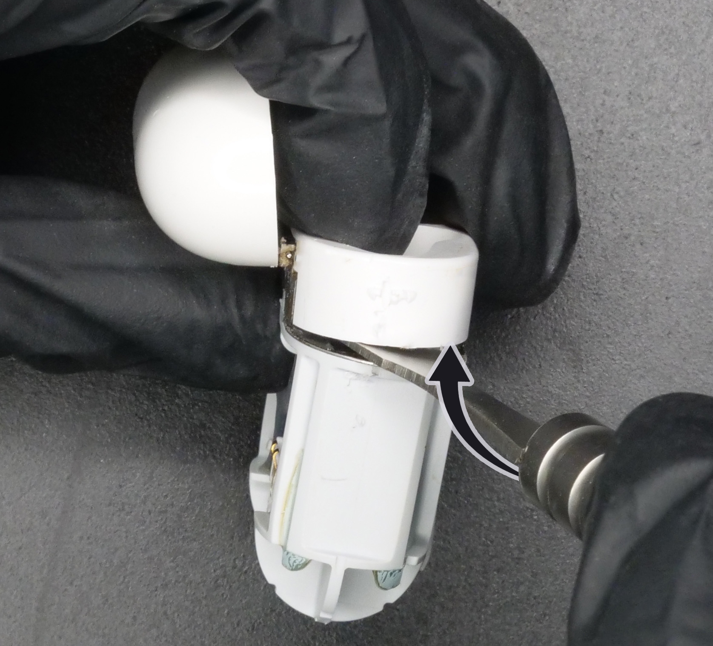
<figcaption><b>Figure 6.</b> Twisting motion</figcaption>
</figure>

Make sure the lid is open. Carefully lift the upper plastic part, while making sure the flex connector is not stuck in the hole (that we pushed in Figure [4](#pushing_the_flex)). The upper part is now fully free and we can work on the lower part.

<figure markdown id="separated_upper_and_lower_parts">
  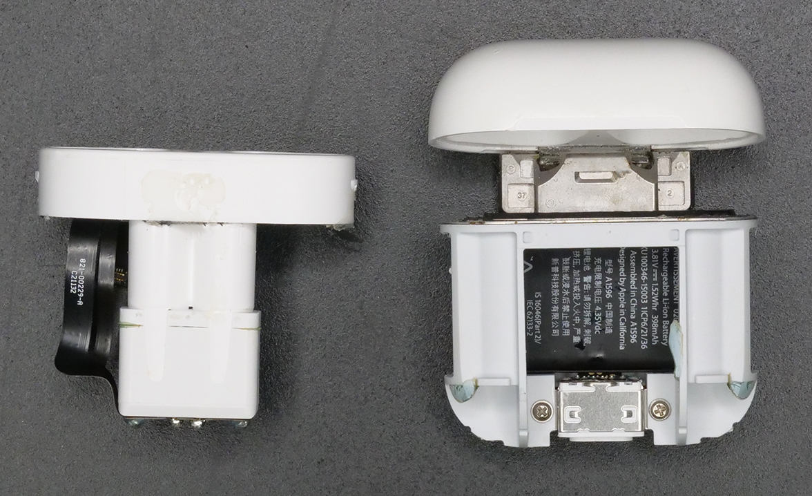
<figcaption><b>Figure 7.</b> Separated Upper and Lower Part</figcaption>
</figure>

Ok, now I'm separating the next two steps into chapters, depending on if you only want to [replace the battery](#2a-battery-replacement), or only [upgrade to USB-C](#2b-usb-c-kit-install), or both!
___

## 2a. Battery Replacement

Add some IPA where the battery is glued (Figure [8](#battery_glue), along the red line) and wait 30 seconds. Then, with a prying tool, push the battery outwards to unglue it (Figure [8](#battery_glue), direction of the arrow). Make sure not to go too deep with the prying tool as you migh rip the flex cable of the battery (Figure [9](#battery_flex)). Could also potentially work with some force and without IPA.

<figure markdown id="battery_glue">
  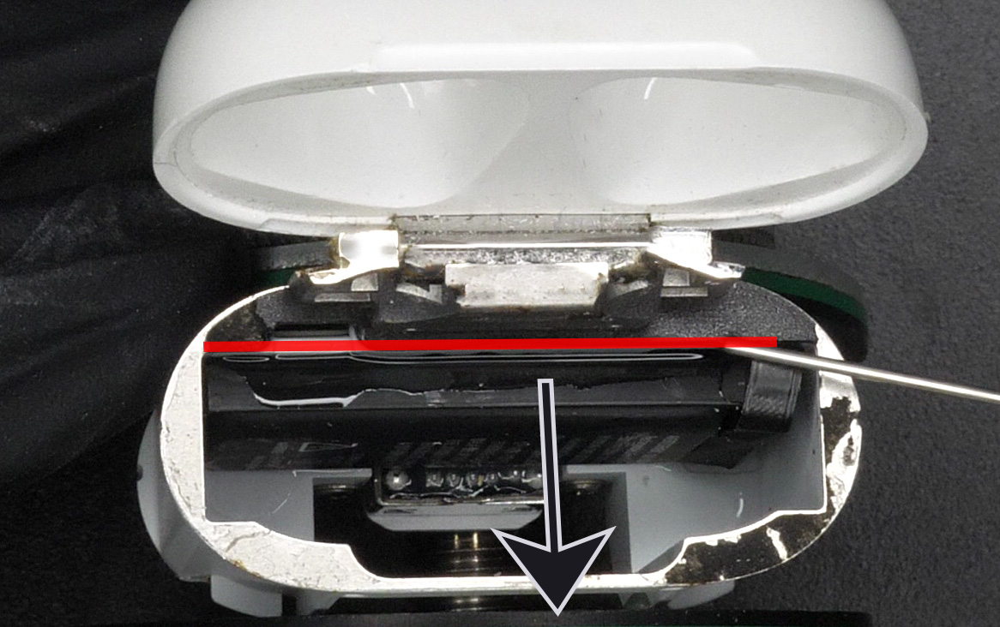
<figcaption><b>Figure 8.</b> Battery Glue</figcaption>
</figure>

<figure markdown id="battery_flex">
  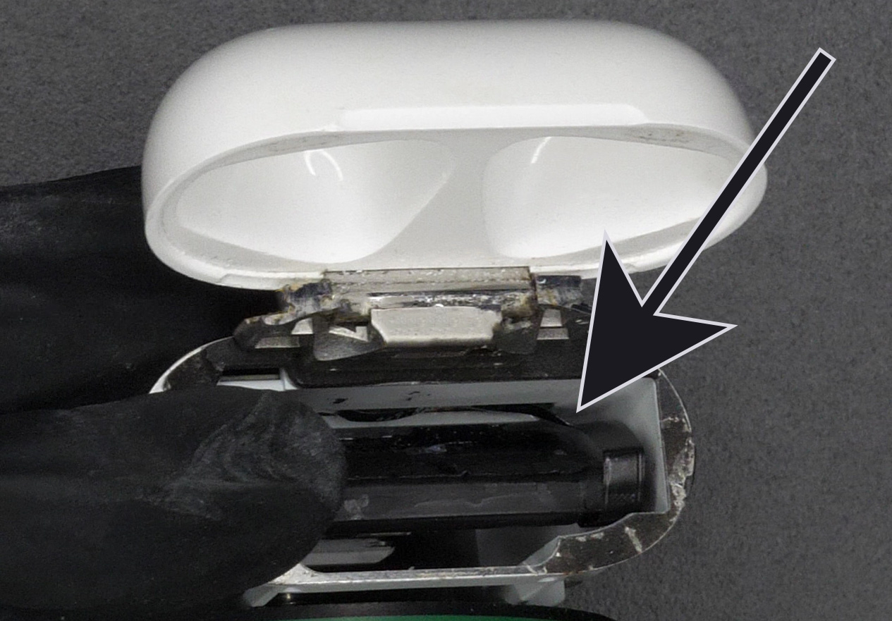
<figcaption><b>Figure 9.</b> Battery Flex</figcaption>
</figure>

Now to unplug the battery flex, we will remove the battery from this slot it is sitting in. We need to move it with a special clockwise (while looking from the front of the case) rotation motion. This motion allows us to dislodge us the battery without unplugging it or ripping the flex cable. I haven't seen this method elsewhere, kind of proud of it. What you do is that you try to rotate the battery by freeing the bottom left corner first (Figure [10](#battery_rotation)).

<figure markdown id="battery_rotation">
  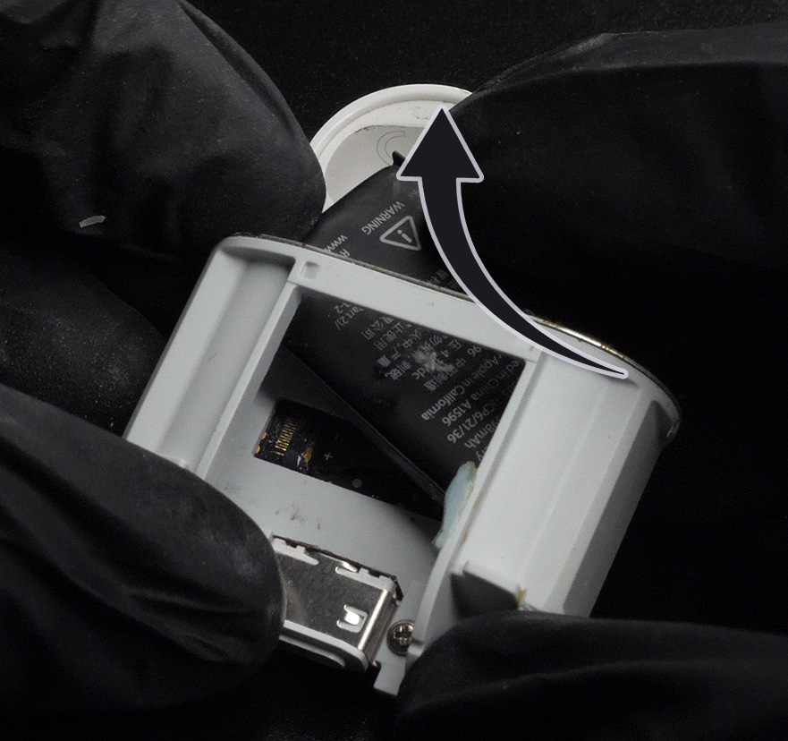
<figcaption><b>Figure 10.</b> Battery Rotation</figcaption>
</figure>

After that, you can also rotate the battery 180 degrees so that it just sits on the lid and you don't have to touch it anymore.

Now we are going to disconnect it. First lift the little flap with some tweezer (Figure [11](#battery_flex_unplugging), curved arrow). Then pull on the flex connector with your tweezers (Figure [11](#battery_flex_unplugging), direction of the straight arrow).

<figure markdown id="battery_flex_unplugging">
  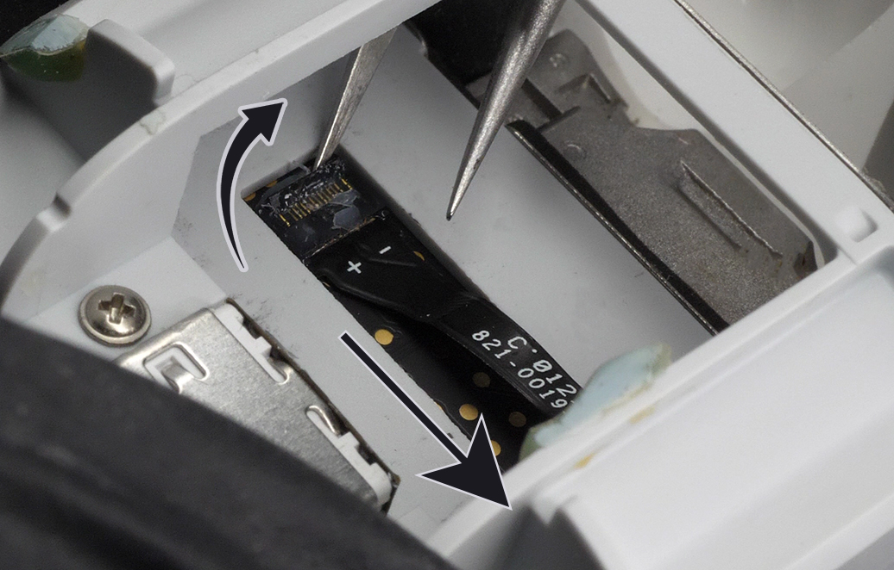
<figcaption><b>Figure 11.</b> Battery Flex Unplugging</figcaption>
</figure>

Congrats, battery is removed. Just follow the steps of this chapter backwards to plug back in the new battery. 

Then, you can [install your USB-C Kit](#2b-usb-c-kit-install), or do the [final reassembly](#3-reassembly).
___

## 2b. USB-C Kit Install

On this page, we just want to remove the Lightning connector and replace it with the USB-C flex. Start by removing the 2 screws (Figure [12](#lightning_screws)) holding the Lightning connector with your PH00 screwdriver.

<figure markdown id="lightning_screws">
  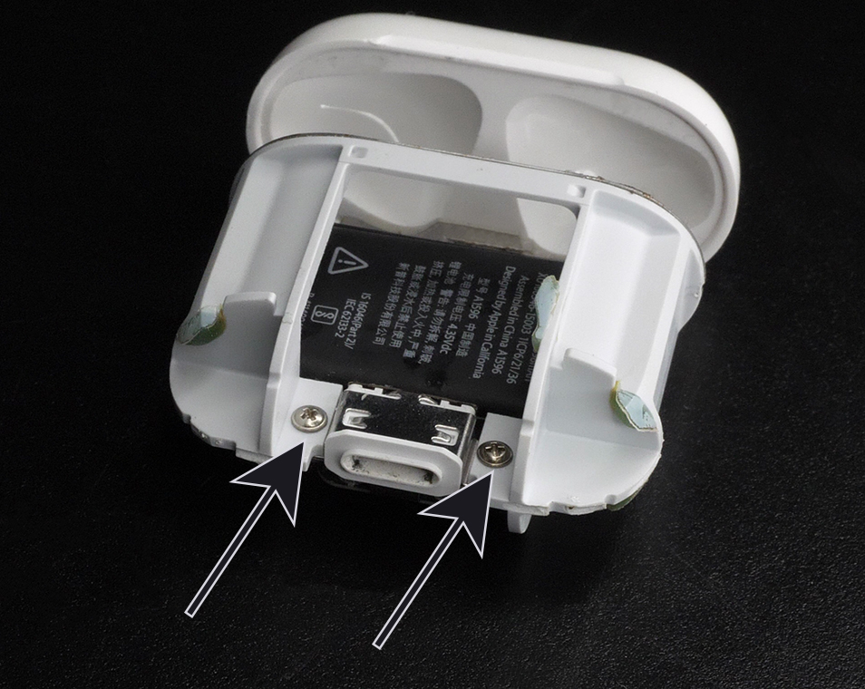
<figcaption><b>Figure 12.</b> Lightning Screws</figcaption>
</figure>

Then, push the Lightning connector from the battery towards yourself. This will reveal an additional two screws (Figure [13](#lightning_b2b_screws)) underneath securing the Lightning B2B connector. Once they are removed, you can also remove the small metal bracket underneath (let's call it MB02).

<figure markdown id="lightning_b2b_screws">
  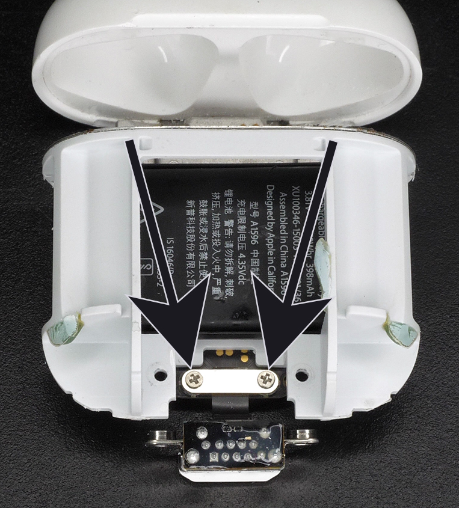
<figcaption><b>Figure 13.</b> Lightning B2B Screws</figcaption>
</figure>

Now you can unplug the Lightning B2B connector (Figure [14](#unplugging_the_lightning_connector)) with some tweezers.

<figure markdown id="unplugging_the_lightning_connector">
  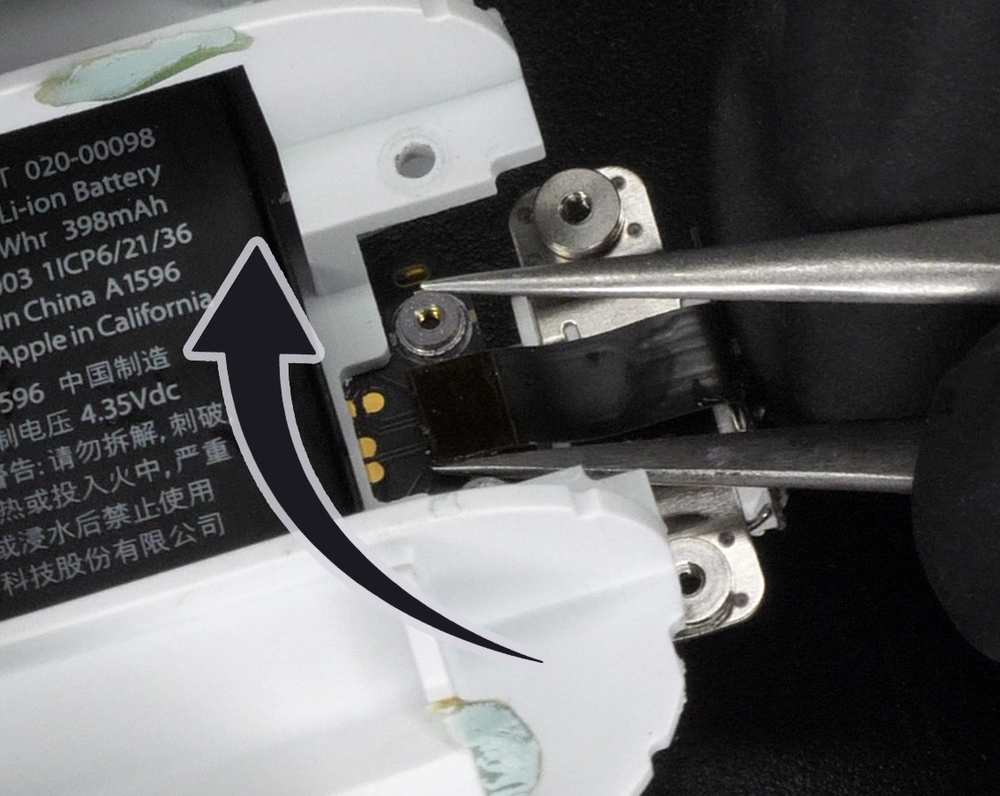
<figcaption><b>Figure 14.</b> Unplugging the Lightning Connector</figcaption>
</figure>

Let's take our new USB-C connector and pre-bend the flexible parts. There are two bends you need to make. To help you, there are two white lines (Figure [15](#bend_help_line)) on the PCB, those white lines always go *inside* the bend radius. On Figure 16, we see the final bend. The USB-C connector is facing down and the B2B connector is also facing down (Figure [16](#bent_pcb), arrow)

<figure markdown id="bend_help_line">
  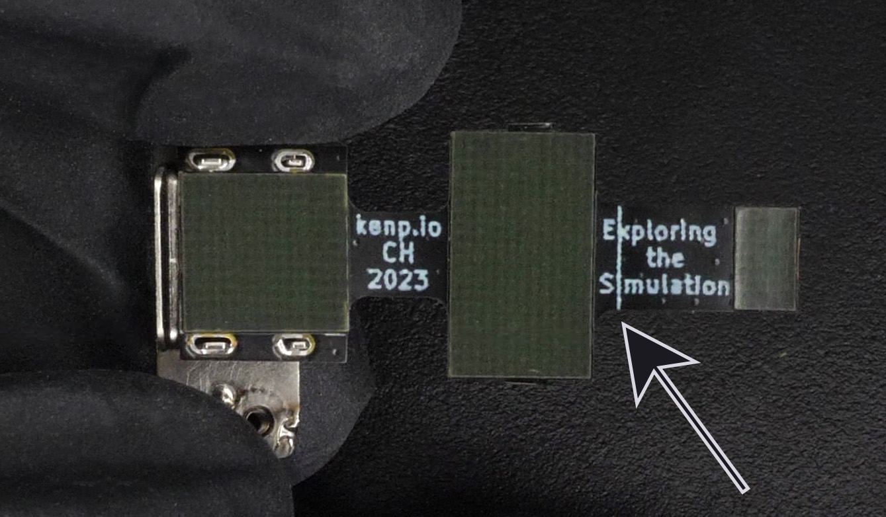
<figcaption><b>Figure 15.</b> Bend Help Line (the other is on the other side)</figcaption>
</figure>

<figure markdown id="bent_pcb">
  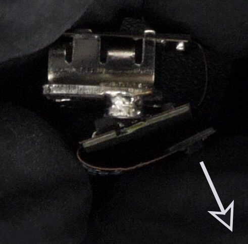
<figcaption><b>Figure 16.</b> Bent PCB</figcaption>
</figure>

Now we plug in the B2B connector (reverse of Figure [14](#unplugging_the_lightning_connector)). After that, we take the small metal bracket (MB02), add a little strip of adhesive (comes with the kit) and place it back on top of the B2B connector while making sure it aligns with the screws holes. The adhesive is just to help keep it in place and makes it way easier to screw back in the two Philips screws. Speaking of those screws, let's place them back where they belong (Figure [13](#lightning_b2b_screws)).

We can now push the USB-C connector in while making sure that it bends the way we intend it to and that the metal plate is underneath the screw holes (Figure [17](#metal_plate_placement), arrow). Once it looks like it's fitting properly, screw it in place with the two Philips screws (of Figure [12](#lightning_screws)).

<figure markdown id="metal_plate_placement">
  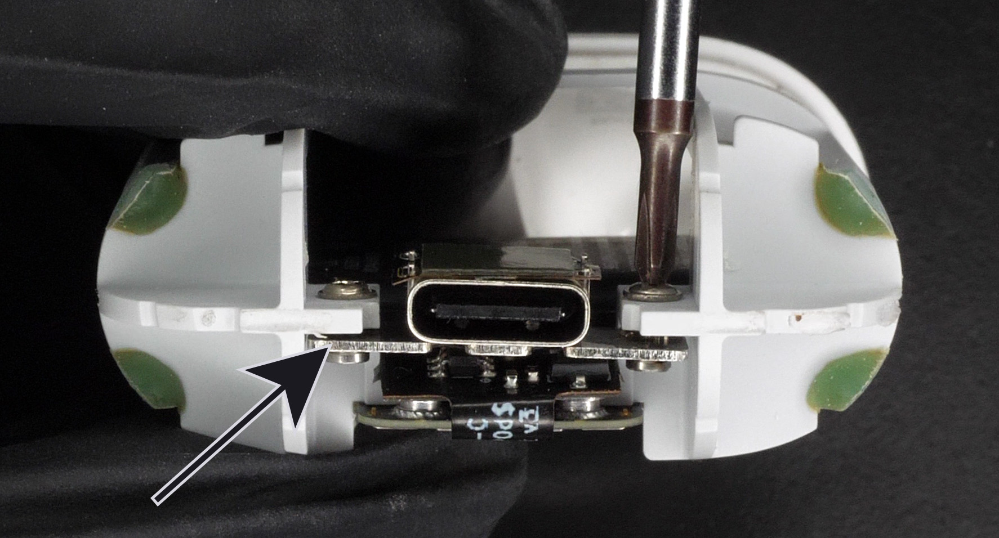
<figcaption><b>Figure 17.</b> Metal Plate Placement</figcaption>
</figure>

Congrats, the USB-C part is now installed.

You can now do the [final reassembly](#3-reassembly).
___

## 3. Reassembly

Remove the excess 4 spots of green glue (Figure [18](#green_glue_removal), 4 arrows) that dripped at the bottom of the lower plastic part. Make sure they are completely gone and that only flush white plastic is left.

<figure markdown id="green_glue_removal">
  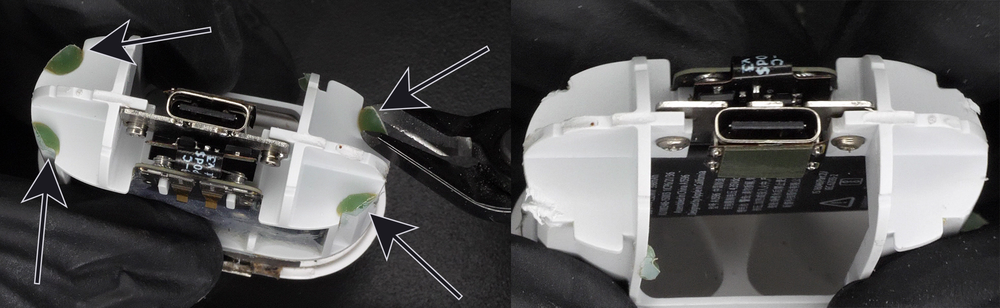
<figcaption><b>Figure 18.</b> Green Glue Removal</figcaption>
</figure>

Partially insert back the upper plastic part while making sure its flex PCB goes through its hole (Figure [4](#pushing_the_flex)). Plug the B2B connector back to the mainboard. Place back the metal bracket (MB01) and screw back in the two Philips screws (Figure [3](#buds_charging_flex_unplugging)). You can fully push back in the upper plastic part and make sure it is seated properly (with a similar gap as Figure [5](#clamping_gap)).

With your tweezers, remove all the glue around the upper plastic part (Figure [19](#upper_glue_removal)). 

<figure markdown id="upper_glue_removal">
  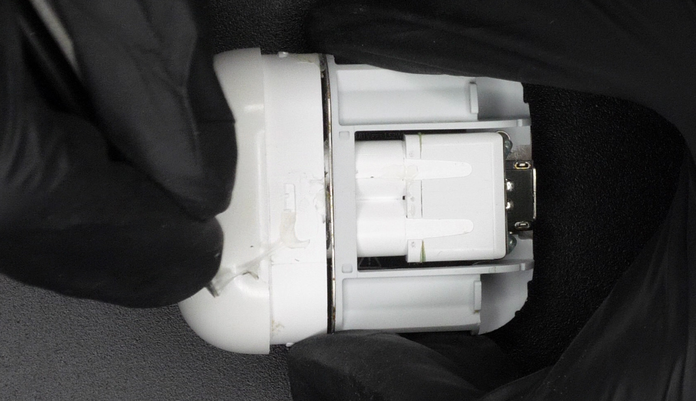
<figcaption><b>Figure 19.</b> Upper Glue Removal</figcaption>
</figure>
- For A1602: There are two plastic teeth, one on each side. You need to remove them by sanding them down (Figure [20](#A1602_teeth_removal)). 
- For A1938: There are two plastic teeth, one on each side. You can leave them. Just make sure there is no glue left.

<figure markdown id="A1602_teeth_removal">
  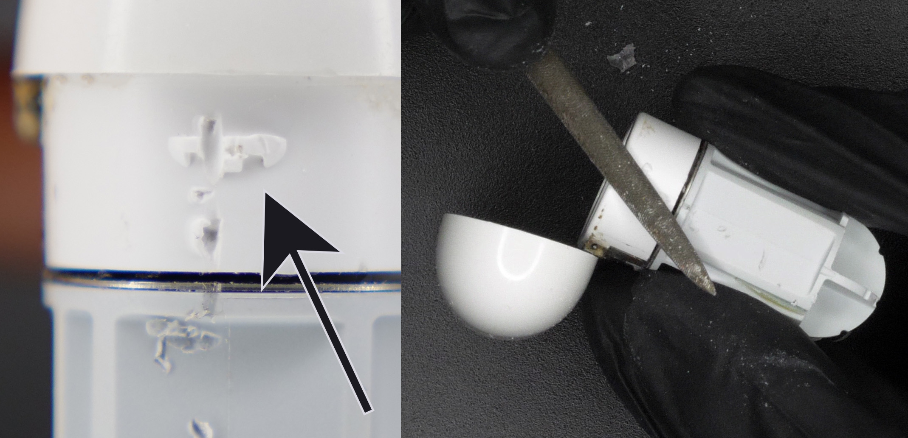
<figcaption><b>Figure 20.</b> A1602 Teeth Removal</figcaption>
</figure>

Unscrew the big outer screw on your new outer shell and remove the nut inside the shell (Figure [21](#big_screw_and_nut_removal)) .

<figure markdown id="big_screw_and_nut_removal">
  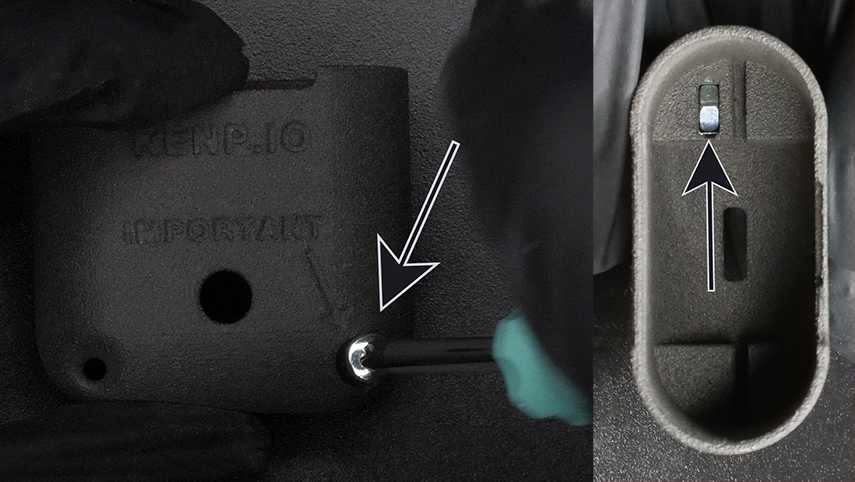
<figcaption><b>Figure 21.</b> Big Screw and Nut Removal</figcaption>
</figure>

Remove the button from the old outer shell by pushing it inwards from outside with your finger (Figure [22](#button_removal)). 

For A1938 only, the wireless charging coil should come out with it. Please do not use any metal tools for this step, only your fingers. If you struggle, add a few drops of IPA to soften the adhesive.

<figure markdown id="button_removal">
  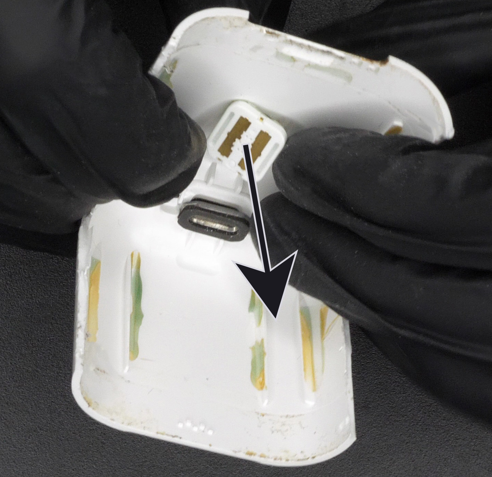
<figcaption><b>Figure 22.</b> Button Removal</figcaption>
</figure>

Place the bouton inside the new outer shell (Figure [23](#button_insertion), straight arrows). You don't need glue, gravity will do its thing to keep it in place when you insert the rest of the case. Just make sure that the golden pins are parallel to the direction you're inserting the bouton in (Figure [23](#button_insertion), golden pins are shown with the curved arrows, pins should be parallel to the straight arrow).

<figure markdown id="button_insertion">
  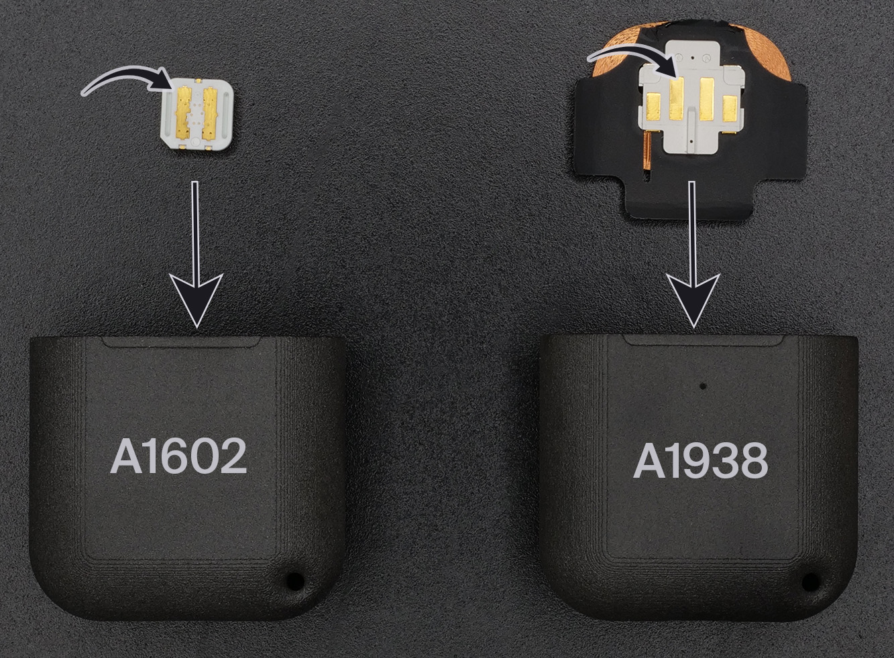
<figcaption><b>Figure 23.</b> Button Insertion</figcaption>
</figure>

While keeping the shell with the button properly aligned, insert the case assembly inside the shell. It should slide in without significant force. Turn your case around and check that the button stayed in its place.

Now is a good time to check that everything works well. Check that the charging port is well aligned and that you can plug in a cable without trouble. Open the lid, insert the buds, insert your charging cable and check that the LED turns orange. Long-press the button and check that the LED turns white (lid needs to be open with buds in the case). If everything looks good, we are ready to do the final step.

Clamp your case inside your vise, with the button facing up. The jaws of the vise should bite where the lid is and where the charging port is (like on Figure [24](#lanyard_and_screw_holes)). The vise should apply some pressure, but not too much.

There are two hole on the shell, it is important to not mix them up. 

- **Lanyard Hole**: Figure [24](#lanyard_and_screw_holes), left arrow.  The hole has curved edges and has a corresponding hole on the other side of the shell.
- **Screw Hole**: Figure [24](#lanyard_and_screw_holes), right arrow. The hole doesn't have rounded edges, they are sharper. When you look on the other side of the case, there is no hole, just the curved surface of the shell.

<figure markdown id="lanyard_and_screw_holes">
  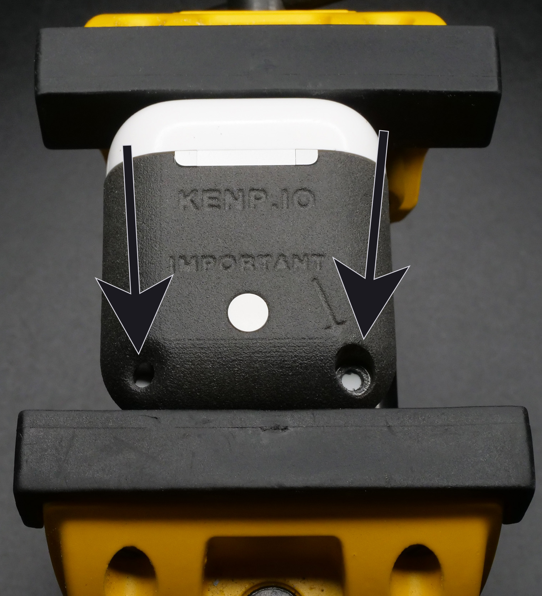
<figcaption><b>Figure 24.</b> Lanyard and Screw Holes</figcaption>
</figure>

Take your drill with your 3mm drill bit installed.

Insert the drill bit in the **Lanyard Hole** and simply drill all the way through the case so that it comes out on the other side. This will create a hole in the white lower plastic part of the case assembly, and it will allow you to pass a lanyard in that hole.

Insert the drill bit in the **Screw Hole**. This is where you don't want to mess up. Again, we want to drill a hole in the white lower plastic part of the case assembly, but that's it, not further. The thickness of the white plastic is 1.3mm, so you shouldn't go much further than that. Basically just make sure you don't drill all the way through. 

Remove the case assembly from the outer shell. Insert back the nut from Figure [21](#big_screw_and_nut_removal). If you struggle to insert it, it is because it only fits with a certain orientation, shown on the left on Figure [25](#nut_orientation).

<figure markdown id="nut_orientation">
  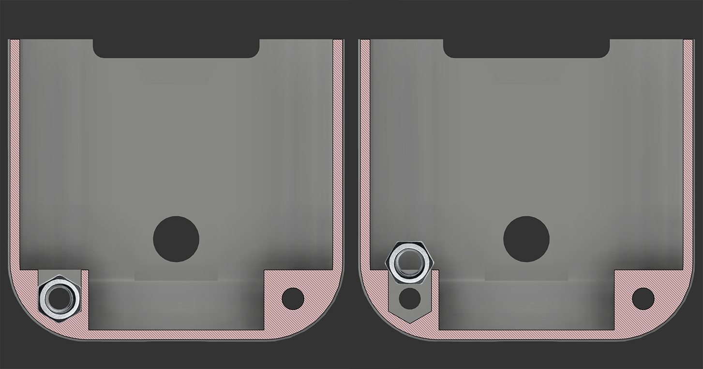
<figcaption><b>Figure 25.</b> Nut Orientation (left is good, right won't work)</figcaption>
</figure>

(Optional if you have A1938. For A1602 you need to skip this.) Salvage the diffuser (Figure [26](#diffuser_spacer), big arrow) by pushing it from the outside of the original case with a needle. Then you can just install it in its new place (Figure [26](#diffuser_spacer), right picture).

(Optional if you didn't install a USB-C kit. You need to skip this if you installed USB-C.) Salvage the metal spacer (Figure [26](#diffuser_spacer), small arrow). Insert it at the bottom of the new shell, should be a snap fit. This will help filling the gap between the shell and the Lightning connector.

<figure markdown id="diffuser_spacer">
  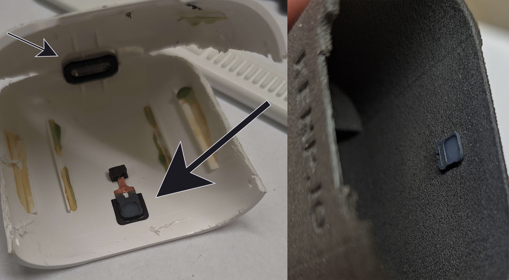
<figcaption><b>Figure 26.</b> Diffuser and Spacer Salvaging</figcaption>
</figure>

Slide the case assembly back in the shell, while making sure the button is properly aligned (Figure [23](#button_insertion)). Screw back in the big screw from Figure [21](#big_screw_and_nut_removal).
___

You did it!! Congrats :) Because you bought from my shop, you gained writing access to my Discord server with the link inside your order confirmation email. Please post a picture of your final result! You can also tweet it at me if you'd like. I would really appreciate it and will definitely congratulate you again.