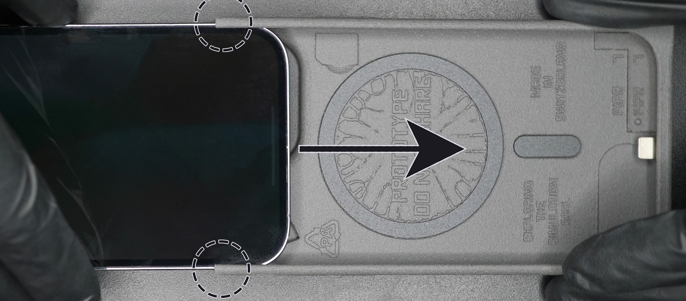
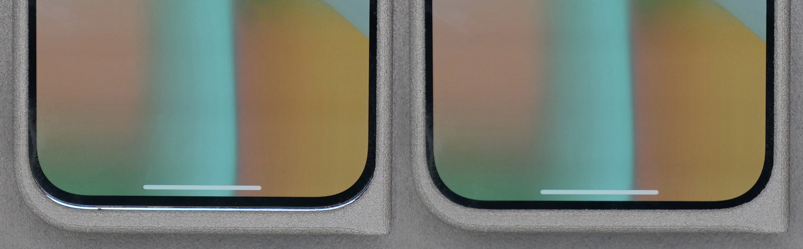
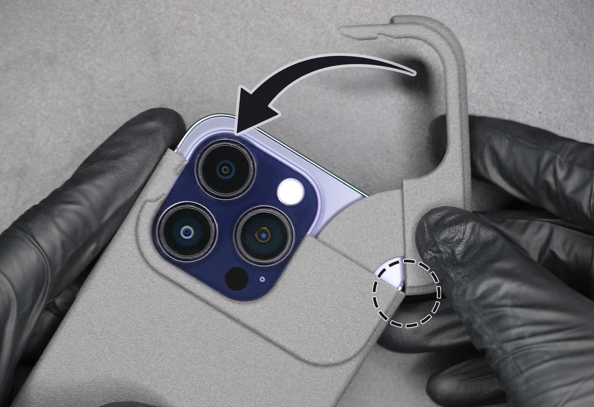
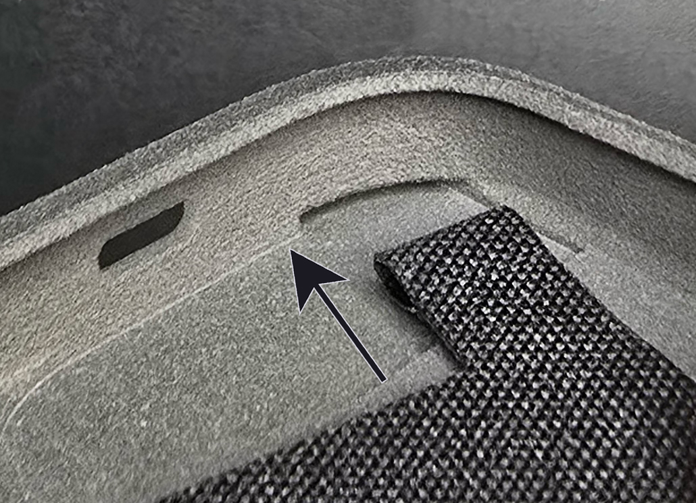

# USB-C Protection Cases for iPhone - Installation Guide
(last updated on 23.07.25)
___

This guide works for any generation of iPhone.
___

## Installation

Ok, let’s get started. It's very easy. You start by sliding in the iPhone from the top of the main part of the case. Make sure it is properly inserted inside the grooves (dotted circles on Figure [1](#inserting_the_iphone)) and slide it flat and parallel to the case (direction of the arrow on Figure [1](#inserting_the_iphone)), not with an angle. 

<figure markdown id="inserting_the_iphone">
  
  <figcaption><b>Figure 1.</b> Inserting the iPhone</figcaption>
</figure>

When you reach the end of the insertion, you will feel like the iPhone clicks in place, this is the Magsafe magnet pulling the iPhone in place. You need to push the iPhone in a little more so that the Lightning connector clicks in too. You can check that it’s fully inserted by checking that the visible black border around the screen is the same size at the bottom of the screen as on the left and right of the screen. On the left of Figure [2](#full_insertion), we see an example of an iPhone NOT fully inserted. On the right of Figure [2](#full_insertion), it is fully inserted.

<figure markdown id="full_insertion">
  
  <figcaption><b>Figure 2.</b> Full insertion (left won't work, right is good)</figcaption>
</figure>

Now that the bottom part of the case is installed, let’s focus on the top. 

Align the two edges as shown inside the dotted circle on Figure [3](#rotation). While keeping those two edges against each other, rotate the top part into position. It will click into place thanks to the tooth located on the left of the cameras.

<figure markdown id="rotation">
  
  <figcaption><b>Figure 3.</b> Securing the top part by rotation.</figcaption>
</figure>

You did it! Congrats :) Wasn’t so hard, right?

___

Got any issue? Please read the [Troubleshooting page](troubleshooting.md).
___

## Removal

Now to remove the case, we just pretty much just apply the same steps backwards. 

With your left thumb, push the latch out in the direction of the straight arrow on Figure [4](#removing_latch). The goal is that it is not blocked by the little tooth anymore. While you push it out, rotate the top part with your right hand as shown by the curved arrow on Figure [4](#removing_latch).

<figure markdown id="removing_latch">
  
  <figcaption><b>Figure 4.</b> Removing the top part by rotation and disengaging the latch. </figcaption>
</figure>

Hold firmly the bottom part of the case with one hand. With the other hand, pull out the iPhone from the top. Again here, we want a straight motion since the iPhone is guided by the grooves. The motion is the opposite of the what is shown by the straight arrow on Figure [1](#inserting_the_iphone).

The iPhone should be fully out!

___

## Lanyard

If you want to add the lanyard option, here is how to do it. 

First rotate the metal loop by about 90 degrees so that the fabric can fit in the small gap (dotted circle on Figure [5](#removing_metal_loop)). Then remove the metal by pulling on it in the direction of the arrow on Figure [5](#removing_metal_loop).

<figure markdown id="removing_metal_loop">
  
  <figcaption><b>Figure 5.</b> Removing the metal loop.</figcaption>
</figure>

Now insert the fabric loop in the slot located at the bottom left corner of your protection case (Figure [6](#fabric_insertion)). You might need to push down with your finger on the fabric loop so that it can pass through. 

<figure markdown id="fabric_insertion">
  
  <figcaption><b>Figure 6.</b> Inserting the fabric loop.</figcaption>
</figure>

To conclude, reinsert the metal loop in the fabric loop by doing the inverse movement of what was shown on Figure [5](#removing_metal_loop). 

Rotate the metal loop so that its gap is hidden by the fabric loop. 

That’s it!

___

You did it!! Congrats :) Because you bought from my shop, you gained writing access to my Discord server with the link inside your order confirmation email. Please post a picture of your final result! You can also tweet it at me if you'd like. I would really appreciate it and will definitely congratulate you again.

