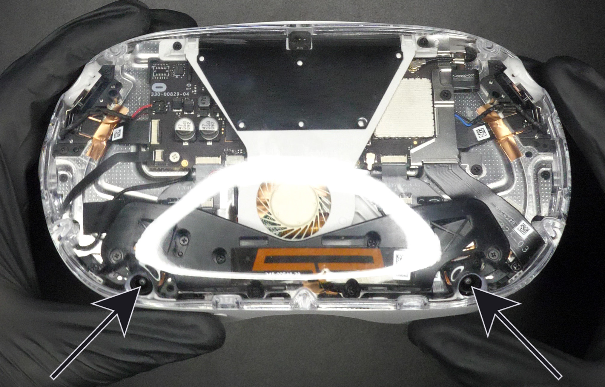

# Clear Kit (v1) - Assembly Guide
(last updated on 01.04.24)
___
## Intro

This is a very quick and straightforward guide. Make sure to read it throughly before starting the install. It is heavily inspired by the [iFixit teardown guide](https://www.ifixit.com/Guide/Oculus+Quest+2+Disassembly/139759){:target="_blank"}. You can also give it a look if you want different pictures.

___

## Tools

* A Torx T2 screwdriver.
* A Phillips PH0 screwdriver.
* A pair of fine tweezers.
* A guitar pick. I found that the Ernie Ball Everlast 0.73mm works great. There will be one included in your kit.

___

## Installation

Ok, let’s get started. First step is very easy, we just want to remove the head strap and face plate. There's loads of videos on YouTube showing how to do it. An example is shown on Video [1](#video1).

<iframe width="560" height="315" src="https://www.youtube.com/embed/5u5npP0S7Qs?si=DjP_KIys9lXzPnOS&amp;start=25" title="YouTube video player" frameborder="0" allow="accelerometer; autoplay; clipboard-write; encrypted-media; gyroscope; picture-in-picture; web-share" allowfullscreen></iframe>
<figcaption><b>Video 1.</b> Strap and Face Plate removal (starts at 0:25)</figcaption>

Remove the six T2 screws shown on Figure [1](#front_screws_removal).

<figure markdown id="front_screws_removal">
  
  <figcaption><b>Figure 1.</b> Front Screws Removal</figcaption>
</figure>

Insert the guitar pack at the bottom of the Quest where the nose usually sits (Figure [2](#interiorPlate), small straight arrow). Then slide the guitar pick to the left along the curved arrows. When you reach the big straight arrow, push inwards to free the plastic clip holding the plate.

Now insert the guitar pick again where the nose sits and repeat the same procedure on the right side.

Be careful to not completely lift off the plate, it is still attached with a flexible cable (Figure [3](#flexCareful), small straight arrow).

<figure markdown id="interiorPlate">
  
  <figcaption><b>Figure 2.</b> Interior Plate Removal</figcaption>
</figure>

Carefully lift off the interior plate by holding it from the nose area and opening it like a book. We do not want to rip off the face proximity flex cable shown on Figure [3](#flexCareful).

<figure markdown id="flexCareful">
  
  <figcaption><b>Figure 3.</b> Face Proximity Flex Cable</figcaption>
</figure>

Carefully disconnect the face proximity flex cable. To do so, lift the black plastic flap by rotating it upwards from the side facing the interior plate. The movement is shown on Figure [4](#flexFlap).

After this, you can slightly lift the flex cable (because it is also held with some tape) and then pull it out of the white connector.

You now completely disconnected the interior plate from the main body.

<figure markdown id="flexFlap">
  
  <figcaption><b>Figure 4.</b> Face Proximity Flex Connector</figcaption>
</figure>

Remove the three PH0 screws (Figure [5](#innerScrews), bottom small arrows). If you feel like you're stripping those screws, try a PH00 screwdriver. 

With the screwdriver that worked best (PH0 or PH00), remove the last two screws (Figure [5](#innerScrews), top big arrows). They are located deeper inside the device.

<figure markdown id="innerScrews">
  
  <figcaption><b>Figure 5.</b> Inner Screws Removal</figcaption>
</figure>

With the guitar pick, pry off the front cover by inserting the pick on the top of the device where the arrows start on Figure [6](#frontCoverTop). Push out the front cover in the direction of the arrows.

<figure markdown id="frontCoverTop">
  
  <figcaption><b>Figure 6.</b> Front Cover Removal - Top</figcaption>
</figure>

Now do the same but on the bottom of the device. Insert the guitar pick as shown on Figure [7](#frontCoverBottom). The front cover should lift off completely and be free of the main chassis.

<figure markdown id="frontCoverBottom">
  
  <figcaption><b>Figure 7.</b> Front Cover Removal - Bottom</figcaption>
</figure>

Insert the new transparent front cover while making sure the orientation is correct. To do that, just make sure the two bottom camera holes match the holes in the front cover (Figure [8](#clearFrontCameras), shown by the arrows).

<figure markdown id="clearFrontCameras">
  
  <figcaption><b>Figure 8.</b> Front Cover Camera Holes</figcaption>
</figure>

Now this is important. **DO NOT** insert back the 5 inner screws from Figure [5](#innerScrews). Simply tape them to the old front cover so that you don't loose them. We don't use them anymore because if you screw them in too much you might crack the new transparent cover. I also found that the cover is already held in place very well with the plastic latches. It's also very convenient if you want to clean up dust or change to another cover, you won't have to dissassemble your device again. 

Carefully reconnect the Face Proximity Flex from Figure [4](#flexFlap) by sliding in the white connector and then closing the black plastic flap on it.

While minding not to rip off the Face Proximity Flex, place the Interior Plate from Figure [2](#interiorPlate) back in place and then push it in until it's flush and you hear clicking sounds. 

Screw back in the six T2 screws from Figure [1](#front_screws_removal).

Finally, we just want to insert back the head strap and face plate. This should be fairly easy, but you can watch Video [1](#video1) starting at 0:48 if you want to see how to do it.

___

You did it!! Congrats :) Because you bought from my shop, you gained writing access to my Discord server with the link inside your order confirmation email. Please post a picture of your final result! You can also tweet it at me if you'd like. I would really appreciate it and will definitely congratulate you again.